# MODELS — walras

The data and domain models, as built. Sources of truth are the TypeScript types and the
SQLite DDL this document cites; where a shape is generated into other artifacts
([`api/openapi.yaml`](./api/openapi.yaml), [`diagrams/catalog-erd.svg`](./diagrams/catalog-erd.svg)),
this document explains the model and links the generated artifact rather than
duplicating it. References: [`FACTS.md`](./FACTS.md), [`DECISIONS.md`](./DECISIONS.md).

---

## 1. Resource identity

A **Resource** is the thing a buyer pays for. Its identity differs by type, and the
difference is a spec MUST, not a walras choice (FACTS F-029, Q-001):

| Type | Identity key | Why |
| --- | --- | --- |
| `http` | canonical URL | one route, one resource |
| `mcp` | the tuple (`resource.url`, `input.toolName`) | MCP multiplexes many tools over one endpoint URL — keying on URL alone makes two tools on one server overwrite each other, a defect the reference e2e catalog actually has (D-009) |

In storage the key is uniformly `(resource, type, toolName)` with `toolName = ''` for
HTTP (the `resources` table's UNIQUE constraint — see the ERD). The canonical URL is
`origin + routeTemplate` when the seller declared a valid template, else
`origin + pathname`; query string and fragment are stripped (F-051).

The MCP-server's public `resourceId` is a versioned, self-describing encoding of the
same tuple — `"wr1:" + base64url(JSON [type, resource, toolName])` — deterministic on
every server, strict on parsing, re-resolved against the live catalog before any
payment (D-029).

## 2. Listing

What the catalog stores per resource (`CatalogListing` in
`packages/bazaar/src/store.ts`); the wire projection is the stock SDK's
`DiscoveryResource` shape (F-050), documented in the generated
[OpenAPI components](./api/openapi.yaml).

| Field | Source | Trust status |
| --- | --- | --- |
| `resource`, `type`, `toolName` | derived from the validated extension (F-051) | validated at Boundary 2 (indexer) |
| `ownerPayTo` | `paymentRequirements.payTo` of the settled payment | **the only trustworthy identity signal** — the scheme verified the on-chain transfer credits it (F-035), and settlement proved the payment was real (D-024) |
| `description`, `mimeType` | echoed extension | schema-validated, otherwise as-sent |
| `serviceName`, `tags`, `iconUrl` | echoed extension | soft-drop validated per F-031 (length, charset, host checks); an invalid field is dropped, not the listing |
| `extensions` | the echoed `PaymentPayload.extensions` | validated (protocol invariants + client schema, F-072); carries the calling convention (F-082) |
| `accepts[]` | requirements observed across settlements, deduped | **advisory** — a buyer always pays against the live 402 from the resource server itself (D-024) |
| `firstSettledAt`, `lastSettledAt`, `settleCount` | walras clock at settle time | walras-authored bookkeeping |

Internal bookkeeping (`ownerPayTo`, `toolName`, `firstSettledAt`, `settleCount`) is
deliberately not exposed on the wire: the SDK type has no fields for it, and additive
fields would invite clients to depend on walras-only shape. The MCP tuple key remains
recoverable from `extensions.bazaar.info.input.toolName`, which is on the wire (F-029).

## 3. Settlement record

walras is non-custodial and keeps the payment path stateless: **there is no persisted
settlement table**. The "settlement record" is three artifacts that together answer any
audit question, each already permanent or reproducible:

| Artifact | Carries | Where it lives |
| --- | --- | --- |
| The on-chain transaction | transfer, fee actually charged, submitter, ledger, timestamp | the Stellar ledger — query Horizon by the receipt's hash (EVIDENCE S2-3 does exactly this) |
| The `SettleResponse` receipt | `success`, 64-hex `transaction` hash, `network`, `payer` (F-038) | returned to the seller; the seller's middleware forwards it to the buyer in `PAYMENT-RESPONSE` (F-065) |
| The catalog trace | `accepts` row (scheme, network, asset, amount, payTo) + `lastSettledAt`, `settleCount` | the `accepts` table, for listings only — a settlement without a discovery extension leaves no walras-side trace beyond logs, by design |

Fees are not in the receipt (the wire type has no field for them); the fee is an
on-chain fact — 22 973 stroops on the single-submitter path (F-069, EVIDENCE S2-3),
23 073 on the fee-bump path (F-086), read back from Horizon, never asserted from memory.

## 4. Soft-drop record

A soft drop is a *client-attributable* cataloging rejection whose settlement stayed
successful. It is a wire artifact, not a stored one: the `bazaar` object inside the
`EXTENSION-RESPONSES` header (F-024) —

```json
{ "bazaar": { "status": "rejected",
              "rejectedReason": "<human-readable, per spec>",
              "code": "<machine code, additive per D-014>" } }
```

The codes and their canonical text are generated into
[`reference/errors.md`](./reference/errors.md) from `packages/bazaar/src/reasons.ts`.
Two deliberate asymmetries (D-025): field-level metadata defects (`serviceName`, `tags`,
`iconUrl`, `routeTemplate`) drop the *field* and keep the listing (F-030, F-031) — those
produce no `rejected` status at all; and a walras-internal indexer fault omits the
header entirely, because reporting a walras bug as `rejected` would tell the seller to
fix a payload that is fine. Nothing about any of this is persisted beyond logs; the
seller's signal is the header on its own settle response, observed live in EVIDENCE
S3-4.

## 5. Search document

What the BASELINE retriever indexes per listing (D-026) — the FTS5 virtual table
`search_index`, maintained in the same transaction as the catalog row so it can never
drift from the catalog:

| FTS field | BM25 weight | Content |
| --- | --- | --- |
| `name` | 4.0 | `serviceName` |
| `description` | 2.0 | listing description |
| `params` | 1.0 | parameter **names** + JSON-Schema `description` annotations extracted from the echoed extension — example *values* are deliberately excluded (an example city says nothing about what a resource does) |
| `tags` | 3.0 | tags, space-joined |

Weights are rule-of-thumb and explicitly untuned; the eval harness (ARCHITECTURE §8.2,
EVIDENCE S4-3) is how any retuning would be justified. Queries never reach FTS5 raw —
they are compiled to quoted-token OR expressions because raw MATCH syntax throws on
operator characters (F-076).

## 6. Payment lifecycle



*Source: [`diagrams/payment-lifecycle-state.mmd`](./diagrams/payment-lifecycle-state.mmd)*

Reading rules for the diagram:

- Every terminal state carries a non-null reason: `Rejected` and `SettleFailed` carry a
  code from the generated [error registry](./reference/errors.md) (D-007);
  `SoftDropped` carries a `bazaar_*` code in the header (D-014); `NotListed` means the
  client echoed no extension — the seller cannot force a listing and the client cannot
  be listed without paying (F-032, D-004).
- `Settling` re-verifies in full even after a successful `/verify` — spec mandate,
  executed inside the scheme's `settle()` (F-036). A payment can therefore reject at
  settle time with a *verify*-path code.
- Everything below `Settled` runs off the settlement path and cannot change the
  settlement outcome (D-015); the three indexing outcomes differ only in the
  `EXTENSION-RESPONSES` header (D-025).

## 7. Catalog ERD



*Generated from the store's DDL by `pnpm docs:gen`
([`diagrams/catalog-erd.mmd`](./diagrams/catalog-erd.mmd)); regenerating against the
current code is what keeps this diagram truthful (writing rule R3).*

Notes the PRAGMAs cannot express:

- `resources` UNIQUE `(resource, type, tool_name)` is the identity key of §1; the
  ownership column `owner_pay_to` is §2's trust anchor (D-024). The check-and-write on
  ownership runs inside one `BEGIN IMMEDIATE` transaction, so two concurrent
  settlements cannot race the check.
- `accepts` UNIQUE on `(resource_id, scheme, network, asset, amount, pay_to)` is what
  "accepts accumulate deduped" means mechanically (D-024).
- `extension_keys` exists for the `extensions` list-filter (F-025): one row per
  extension name a listing carries.
- `search_index` is FTS5 (§5); its `rowid` equals `resources.id`, maintained in the
  same transaction (D-026).
- Storage engine: Node's built-in `node:sqlite`, WAL journal mode, 100 ms busy timeout
  (D-023) — reads proceed while a settle-hook write is in flight, and a contended
  write fails fast rather than delaying a settlement response (D-015).
