# THREAT MODEL — walras

STRIDE-lite over the two trust boundaries. Every row names the threat, the control as
built, and the test or transcript that exercises it — a control without a test is
labeled as such. Status: **testnet, unaudited** (see §4). References:
[`FACTS.md`](./FACTS.md), [`DECISIONS.md`](./DECISIONS.md),
[`EVIDENCE.md`](./EVIDENCE.md).

*Source: [`diagrams/trust-boundaries.mmd`](./diagrams/trust-boundaries.mmd)*

The frame: everything a client sends is hostile until validated — the payment payload
(a client-built transaction plus auth entries) and the echoed discovery extension
(F-072). walras holds two kinds of state worth protecting: the submitter seeds and the
catalog. The Stellar ledger is the final arbiter of the payment path; the indexer is
the sole writer of the catalog.

---

## 1. Boundary 1 — the payment path

Controls here are almost entirely the scheme's verification MUST list (F-035), which
walras inherits by wrapping and never weakens (D-007, D-008). One structural fact
matters for several rows: the scheme's own signature check only tests that a signature
is *present*, not that it verifies — **simulation success is the cryptographic
control**, not defence-in-depth (F-062).

| Threat (STRIDE) | Control as built | Test that exercises it |
| --- | --- | --- |
| Tampered auth entry — signature bytes altered after signing (Tampering) | Simulation MUST succeed; the Soroban host rejects the forged signature (F-062, F-035) | Modelled with real Ed25519 verification over the CAP-46 preimage: EVIDENCE S1-4 ("the tampered payload, discriminated"). Live collapse to `…_simulation_failed` confirmed in S2-6 |
| Requirements tampered — seller/MITM claims a different amount than the client signed (Tampering) | Pre-simulation argument checks: `wrong_amount`, `wrong_recipient`, `wrong_asset` fire before any network call (F-035, F-064) | Live: S2-6 #2 (amount mismatch → `invalid_exact_stellar_payload_wrong_amount`); demo flag `--tampered`, S5-3 |
| Replay — a settled payload submitted again (Spoofing/Tampering) | Structural, not a coded branch: the auth-entry nonce is consumed on-chain at first settlement, so re-simulation fails; simulation success is a MUST (F-039, D-011). Do not describe this as an application-level replay cache — there is none, deliberately | Live: S2-6 #1 (replayed payload → `/settle` rejected, non-null reason) |
| Expiry race — auth entry used after its ledger bound (Tampering) | Ledger-bounded expiry derived from `maxTimeoutSeconds` (F-034); checked post-simulation, and expired entries also fail simulation itself | Live: S2-6 #3 (expired → rejected on both `/verify` and `/settle`); demo flag `--expired`, S5-3. Modelled boundary check: S1-4 |
| **Known deviation:** the package tolerates expiry 2 ledgers beyond the spec's strict bound, absorbing RPC skew | Inherited from `@x402/stellar`; disclosed rather than forked away (F-046, D-008) | Documented; no walras test asserts the strict bound, by decision D-008 |
| Front-running — an observer lifts the signed auth entry and tries to redirect or drain it (Spoofing/Elevation) | The entry authorizes exactly `transfer(from, to, amount)` on one asset — recipient, amount, and asset are inside the signed preimage (F-033); the nonce permits at most one settlement (F-039); the facilitator refuses to be tx source, op source, payer, or an auth participant (F-035) | Recipient/amount/asset binding: the fixture suite's `wrong_*` cases (S1-2); single-settlement: the replay test (S2-6 #1). No dedicated front-running transcript exists — the claim reduces structurally to these two properties |
| Fee-bid manipulation — client submits an absurd fee to drain the sponsor (DoS) | The facilitator fully overrides the client's fee bid from a fresh settle-time simulation, with a hard ceiling (`maxTransactionFeeStroops`, default 50 000; `…_fee_exceeds_maximum`) (F-037) | Fixture suite covers the ceiling code (S1-2); measured settle fees 22 973 stroops on the single-submitter path (F-069, S2-3), 23 073 on the fee-bump path (F-086) |
| Malformed envelope / unsupported kind (DoS) | Named 400s (`walras_*` codes) before the scheme is consulted; malformed JSON becomes a named rejection, not a Fastify default (D-007) | Facilitator wrapper suite (S1-2 "wrapper-level rejections") |
| Submitter seed disclosure (Information disclosure) | Seeds never echoed in errors (config redacts by construction); `/health` and logs carry `describeConfig` — public addresses only; `.env` is gitignored | `config.test.ts` asserts the invalid-seed error omits the value; no transcript — log-hygiene is enforced in code review |
| Repudiation of a settlement | Every receipt carries the 64-hex on-chain hash (F-038); the ledger is the audit trail | S2-3, S5-5, S6-3 all re-verify receipts against Horizon out-of-band |

## 2. Boundary 2 — the discovery path

The catalog is the RFP's named trust boundary: "clients echo the resource block into
the payment payload, so a hostile client can attempt to poison the catalog" (RFP 3.2).
The SDK's one-shot extractor is explicitly *not* that boundary (F-072); walras composes
the low-level validators itself.

| Threat (STRIDE) | Control as built | Test that exercises it |
| --- | --- | --- |
| Catalog poisoning via trivial schema — payload validates against a client-supplied vacuous schema (Tampering) | Protocol-invariant validation (`validateDiscoveryExtensionSpec`) runs in addition to client-schema validation; either failure soft-drops with a machine code (F-072) | Unit: the trivial-schema poisoning test, S3-2. Live: a settled payment carrying a garbage extension → `bazaar_spec_validation_failed`, settlement untouched (S3-4 #1) |
| Overwrite of an existing listing by a different payTo (Spoofing) | Listing identity is bound to the settled `payTo` — the only client-independent signal, verified on-chain by the scheme (D-024); check-and-write is transactional, so a payment to a different recipient cannot modify an already-owned listing. This defends the *second* claimant only; it does **not** prove the *first* claimant controls the URL — see the squatting row below (D-024, D-032) | Live: settled tx to the wrong payee → `bazaar_listing_owned_by_other_payee`, listing byte-identical after (S3-4 #2); unit: same-payTo merge cannot blank metadata (S3-2); demo flag `--poison-catalog`, S5-3 |
| Hostile `routeTemplate` — traversal or scheme-smuggling hidden behind percent-encoding (Tampering) | Two layers: the SDK's `isValidRouteTemplate` (regex + single decode before the `..`/`://` checks, F-030) **plus** a walras-side `hardenRouteTemplate` that the RFP (3.B) requires and the SDK omits — bounded *repeated* percent-decode to catch double-encoding (`%252e%252e`), and rejection of null bytes, backslashes, and protocol-relative (`//host`) forms the single-decode SDK check accepts (F-088). Failure discards the field, falls back to the concrete path, and logs a `soft_drops` row — soft drop, not rejection | Bazaar poisoning suite incl. the double-encode / null-byte / protocol-relative / backslash cases the SDK alone would pass (S3-2) |
| Cross-seller / cross-tool overwrite — two MCP tools on one URL colliding (Tampering) | Keying on the (`url`, `toolName`) tuple per the spec MUST (F-029) — the reference e2e catalog violates this and walras deliberately does not (D-009) | Store keying tests (S3-2); live: an MCP tool cataloged under the tuple and re-found beside the HTTP listing on the same origin (S6-3 step 7) |
| Hostile service metadata — oversized names, tag floods, dangerous icon hosts (Tampering) | Soft-drop rules per field: `serviceName` charset/length, ≤ 5 deduped tags, `iconUrl` host checks with percent-decode before IP/loopback tests; offending field dropped, listing kept (F-031) | Bazaar metadata suites (S3-2) |
| Index spam via micro-settlements — attacker self-pays trivial amounts to flood the catalog (DoS) | Partially controlled: settle-gating prices every write at a real settlement (D-004); the 64 KiB extensions cap bounds row size (D-025); unique keying dedups repeats. **Residual, stated plainly:** a self-paying attacker sets its own price, and the sponsored network fee (~0.0023 XLM, F-069) is borne by the operator; nothing prunes stale listings yet | Cost mechanics observed: the S3-4 self-transfer settlement (fee 18 374 stroops, sponsored). **PLANNED:** caller authentication / rate limiting (RFP 3.1 leaves the mechanism to the operator; walras will ship it configurable) and a retention policy (the CDP operator prunes at 30 days idle — F-012 — walras has not committed to a number) |
| URL squatting — cataloging a URL you don't control before its owner ever settles (Spoofing) | Not prevented, disclosed (D-032): a settled payment carries no proof its `payTo` controls the echoed `resource.url` origin, so whoever settles first for a key owns it, and the real seller's later honest settlement is rejected `bazaar_listing_owned_by_other_payee`. The catalog is advisory — a protocol-following buyer always pays against the live 402 from the resource server itself, so a squat pollutes metadata and locks out the listing but cannot redirect the buyer's funds. Grant-scope fix: proof-of-origin-control at index time (D-032) | Unit: the attacker-FIRST regression test pins the real behavior — squat succeeds, victim locked out (S3-2). No test claims prevention |
| Search-input injection — FTS5 operator syntax in `query` (DoS) | Queries compiled to quoted-token OR expressions before reaching the engine; raw syntax throws and never gets there (F-076, D-026) | Live hostile-syntax probe (S4-4); retriever unit tests (S4-3) |
| Cursor confusion/forgery — a cursor replayed against a different query (Tampering) | Cursor carries a context-binding hash; mismatch is a named 400 `walras_invalid_search_cursor`, integrity against confusion, not secrecy (D-027) | Live: exactly-once cursor walk + invalid-cursor probe (S4-4); passthrough proven over MCP (S6-3 step 5) |
| Indexer as settlement hostage — a poisoned write breaking payments (DoS) | The indexing invariant: outcome decided before the hook runs; indexer never throws; forced-failure test pins settlement success with a broken store (D-015, D-025) | The D-015 forced-failure test (facilitator suite, S3-2) |
| Indexer ReDoS — a client schema's regex burns the event loop on the settle path (DoS) | The client authors `extensions.bazaar.schema`, which the SDK compiles with Ajv; a catastrophic-backtracking `pattern` on ~140 bytes drives tens of seconds of synchronous compute, and the 64 KiB byte cap does not bound regex runtime (F-087). Control: before Ajv ever compiles, the indexer strips every regex-bearing schema keyword (`pattern`, `patternProperties`, `format`) and caps schema node count, leaving validation linear in the byte-capped `info`; over-budget schemas soft-drop `bazaar_schema_too_complex` (D-033) | Unit: the evil-pattern schema now indexes in < 1 s, and the node-budget rejection fires (S3-2) |

## 3. The MCP surface (composition of both boundaries)

`paid_call` holds an agent's wallet, so its distinct threat is **unbounded spending**:
a hostile or mispriced 402 (including a re-priced retry) draining the wallet. Control:
the spend cap binds twice — a pre-payment check against the probed 402 *and* a
`registerPolicy` filter on the one shared x402 client, so a fresh 402 with a raised
price hits the policy even though the pre-check saw the old one (F-081, D-030). Tests:
the cap declines over-cap and foreign-network demands with the paying seam observably
never invoked (S6-2). Stale-id payments are prevented by re-resolving ids against the
live catalog (`walras_mcp_unknown_resource_id`, D-029; live in S6-3 step 4).

## 4. Audit scope statement (RFP 3.6)

v1 ships **no new Soroban contract**. The audit surface is an offchain service and its
cryptographic validation: the settlement path (wrapping `@x402/stellar`'s verification,
F-035/F-045), auth-entry validation as inherited plus the simulation-as-control fact
(F-062), and the discovery trust boundary of §2. The per-request schemes hold no
persistent on-chain state, so there is no rent/TTL surface (RFP 3.5). A third-party
security review via the Audit Bank is **PLANNED** before any mainnet production tag;
until then every deployment described in this repository is testnet and unaudited, and
[`SECURITY.md`](../SECURITY.md) says so to reporters.
