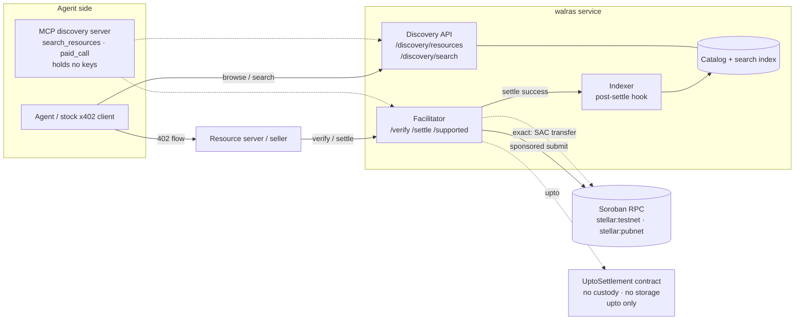
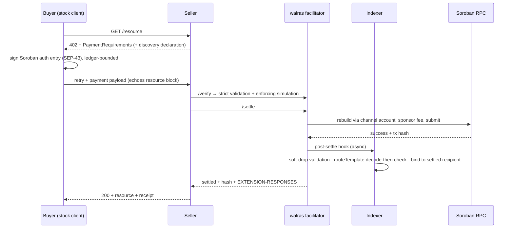

# walras — Technical Architecture

**x402 facilitator + Bazaar discovery layer for Stellar** · Apache-2.0 · github.com/kunaldrall29/walras
Submission: SCF #45, RFP Track — "X402 Facilitator with Bazaar (discovery) support"

This document is complete at the time of application and readable independently of the submission. It states what will be built, why each design decision was made, and how every claim will be verified. Convention used throughout: **[BUILT]** exists and is reproducible from the repository today; **[T1]/[T2]/[T3]** is the tranche that delivers it. Our method is verification-first: every protocol behavior is implemented against the x402 specification at a **pinned commit** recorded in `docs/FACTS.md` (each fact dated and sourced), and every capability claim is backed by a transcript or transaction hash in `docs/EVIDENCE.md`. Where the discovery conventions move — and the RFP is explicit that they will — conformance is re-verified against the new pin, not assumed.

## 1. System overview

x402 turns HTTP 402 into a machine-native payment flow: a client requests a resource, the server answers 402 with terms, the client signs a payment authorization and retries, and a facilitator verifies and settles on-chain before the resource is returned. The buyer is software — typically an agent paying per request with no account and no API key.

walras is four components behind one service boundary, plus one small Soroban contract used only by the `upto` scheme:

Design invariants, enforced in code and tested, not asserted:
1. **Non-custodial.** Funds move payer → recipient inside the client-signed authorization. The facilitator sponsors network fees only; its address must appear nowhere in the client payload (not transaction source, not operation source, not `from`, not in any auth entry) — checked on every verify.
2. **Indexing never touches settlement.** Cataloging runs on a post-settle hook; an indexer failure cannot fail, delay, or alter a payment. Outcomes travel only in the `EXTENSION-RESPONSES` header.
3. **Spec-verbatim wire formats.** Acceptance in this RFP is wire-level; the repo's conformance harness points unmodified stock clients at walras and at the public x402.org baseline and diffs the transcripts. Divergences are our bugs unless the pinned spec says otherwise — in which case they are filed upstream as interop reports.
4. **Every rejection carries a machine-readable code and non-null `reason`**, from one error vocabulary shared across facilitator, discovery, and MCP surfaces.
5. **Permissive end to end.** Apache-2.0; CI license gate fails the build on any copyleft transitive. The OpenZeppelin Relayer, its x402 plugin, and relayer SDK (AGPL) are excluded and never referenced.

## 2. Facilitator (exact scheme) — [BUILT: testnet surface] [T1: hardening]

Built on the Apache-2.0 `@x402/stellar` package; settlement logic is wrapped, not reimplemented — the novel work in this RFP is discovery, the agent interface, `upto`, and conformance that holds as the spec moves.

**Payment flow.** The seller's 402 carries `PaymentRequirements` (CAIP-2 network `stellar:testnet` / `stellar:pubnet`, SEP-41 asset — USDC by default, 7 decimals, amounts as integer base-unit strings). The client builds the SAC `transfer(from, to, amount)` invocation, simulates to discover required authorizations, and signs **Soroban authorization entries** (SEP-43), not a whole transaction. Validity is **ledger-bounded**: `signatureExpirationLedger` ≈ current + ceil(`maxTimeoutSeconds` / est. seconds-per-ledger), ~12 ledgers ≈ 60 s by default.

**Verification.** Strict, grouped by what it defends: protocol shape (v2, scheme, network, exactly the declared invocation); transfer correctness (contract = `requirements.asset`, `to` = `payTo`, amount exact); authorization integrity (signature over the Soroban authorization preimage — any mutation of call, asset, amount, or recipient invalidates it; expiry within bounds; payer signed, nothing else pending); replay (the Soroban host consumes the auth-entry nonce — replay protection is a protocol property, and the facilitator keeps no replay authority of its own); sponsorship safety (invariant 1); and **enforcing-mode re-simulation** whose events must show exactly the expected balance change and no other — recording-mode simulation does not execute signature checks and is never trusted for verification. Classic G-account keypairs and custom `__check_auth` C-accounts are both supported, per the RFP.

**Settlement.** On valid verify, walras rebuilds the transaction with its own (channel) account as source, copies operations and auth entries unchanged, derives the fee from a **fresh settle-time simulation** plus an inclusion buffer (never the client's bid), signs, submits, polls to a terminal state, and returns the hash. `/supported` advertises the Stellar `extra` contract including `areFeesSponsored: true`, read from configuration so it stays correct when upstream adds non-sponsored flows.

**Throughput [T1].** Stellar serializes per source account by sequence number, and agent traffic is bursty, so settlement submits through a **channel-account pool** (round-robin, scripted creation/health/quarantine-on-uncertain-outcome), with the queue bounded by remaining signature validity — a request that cannot land inside its ledger window is rejected immediately with a retryable code rather than queued into guaranteed failure. Idempotency keys and hash recovery cover lost RPC responses.

**Deployment shapes.** (a) Hosted (testnet free, no key; mainnet pricing configurable, never hard-wired — the business model is documented, and any fee is removable by a self-hoster); (b) self-hosted via `docker compose up` (facilitator + database as the base pair); (c) **self-facilitation**: the facilitator core is importable as a library inside a resource server, no external operator — the package boundary is designed for this from day one. Trustlines are a first-class onboarding concern: buyer/seller helpers preflight them and surface a distinct, actionable error (an account cannot receive a SEP-41 asset without one).

## 3. Bazaar discovery layer — [T1: catalog + resources] [T2: search]

The core new capability. The index is **off-chain by design**: an on-chain registry adds rent that must be extended or entries evict, and per-payment anchoring roughly doubles settlement cost, for a property discovery does not need — a poisoned catalog entry costs an agent one wasted request, never funds, because the payment itself is independently bound. Decentralization is achieved through replicability (§9), not through a registry contract.

**Automatic cataloging.** When a settled payment carries the discovery extension, the indexer validates the declared `info` against its schema and catalogs the resource — **no separate registration step**; anything requiring a seller to act after payment gets skipped, so manual registration exists only as a secondary operator path. Both resource types are first-class: HTTP endpoints, and MCP tools keyed on the spec's tuple of `resource.url` and `input.toolName` (one MCP server multiplexes many tools). Outcomes — success, or rejected with a specific reason — are reported in `EXTENSION-RESPONSES` so a seller knows whether the listing landed and why not.

**Trust boundary.** Clients echo the resource block into the payment payload, so every extension payload is treated as hostile:

| Threat | Control (each has a test) |
|---|---|
| Forged metadata | Schema validation with per-field soft-drop (valid remainder preserved) |
| Traversal via `routeTemplate` | **Percent-decode first**, bounded repeated decode for double encoding, then traversal/scheme checks; reject null bytes, absolute and protocol-relative forms |
| Listing another seller's resource | Listing identity bound to the **verified recipient of the settled payment** — no settlement, no listing; no cross-recipient overwrite |
| Price spoofing | Terms taken from the settled payment's requirements, never from free text |
| SSRF via metadata URLs | https/http absolute only, no IP literals or loopback, no redirects followed |
| Catalog flooding | Per-recipient insert limits; settlement-gated listing makes spam cost real money |

**Endpoints.** `GET /discovery/resources` with the spec's `type`, `payTo`, `network`, `extensions`, `limit`, `offset` filters and deterministic ordering (stable pagination under concurrent writes). `GET /discovery/search` with a natural-language query, cursor pagination, and the `partialResults` flag — request and response shapes reproduced verbatim from the spec at the pinned commit and held current as the conventions evolve (§10). Interop: walras listings must be representable consistently with other facilitators' catalogs — the conformance harness diffs our entries against how the same resource appears elsewhere, and divergences are documented or filed upstream. Stellar must not become a walled garden.

**Search quality [T2] — the RFP's hardest deliverable, treated as one.** Retrieval is hybrid — lexical full-text plus semantic embeddings over the discovery `info` structure (resource description and the **per-parameter descriptions** the seller helpers make easy to write, since they are what make an endpoint legible to an agent) — fused by reciprocal-rank fusion behind a stable `Retriever` interface, so ranking can improve without touching the wire shape. Evaluation is the deliverable that keeps it honest: a golden query set built from the **real catalog** (no synthetic corpus inflation) with graded judgments; nDCG@10, MRR, and recall@k published per release and enforced as a CI regression gate that demonstrably fails on a regressing commit. As real traffic accrues, settlement-derived quality signals (distinct buyers, volume, recency, metadata completeness) order results *after* relevance retrieves them — computed from data the facilitator already sees, with house products receiving **zero preference by construction** (the ranking pipeline has no input that could express one).

## 4. MCP discovery server — [T2]

Two tools, exposed to any MCP runtime: `search_resources` (natural-language query over the Bazaar; deterministic JSON with pricing, schemas, per-parameter descriptions) and `paid_call` (the discover → 402 → sign → retry loop). **The server holds no keys**: payloads are built and signed client-side through an auth-entry-shaped signer interface — a plain SEP-43 Ed25519 keypair and a smart-account wallet travel the same path, which matters because x402 on Stellar requires auth-entry signing (Freighter's browser extension supports it today; the docs state wallet reality plainly). Every rejection returns a code and non-null reason from the shared vocabulary, so an agent reasons about failure instead of parsing prose.

## 5. The `upto` scheme — [T2 spec + contract + upstream PR]

`exact` fixes the amount at signing time; metered services (token billing, bandwidth, compute) need "authorize up to a cap, settle actual usage." On Stellar this **requires a contract**, and the reasoning is structural, per the RFP's own framing: a Soroban authorization commits to the exact invocation arguments, so a signed direct `transfer` is a fixed amount; and a bare SEP-41 allowance fails two mandatory properties — `transfer_from` lets the spender choose any recipient (no recipient binding) and a standing allowance is drawable again (no single settlement). We therefore ship a minimal `UptoSettlement` contract: single-function, **no admin, no upgrade path, no persistent storage, never holds a balance**. The client signs one authorization via `require_auth_for_args` over the bound argument list — ceiling, recipient, token, time bound — deliberately excluding the actual amount, which is supplied at settle time and enforced `actual ≤ max` in contract logic; transfer and refund of the remainder are atomic in one transaction, and the Soroban host nonce plus ledger deadline give single-use and time bounding. Facilitator-side validation for the scheme is new security-critical code with its own shape checks (operation target pinned to the advertised contract address, exact auth-tree shape, temporal coupling of allowance expiry to signature expiry) and its own error codes. Composition with **smart-account spending policies** is documented with a reference budget-policy example: the signed tree exposes ceiling, recipient, and token, so an account policy can enforce per-window budgets and allow-lists across any facilitator. Three implementation assumptions (auth-tree shape acceptance, resource-limit fit, TTL coverage of the deadline window) are named in the repo and resolved by testnet tests before the spec is finalized — if reality differs, the spec changes, not the test. `scheme_upto_stellar.md` is authored alongside and contributed upstream through the x402 Technical Steering Committee, using SDF's Governing Board seat to unblock maintainer review. `batch-settlement` and `auth-capture` are deferred per the RFP and not foreclosed: scheme dispatch is a table, not a rewrite.

## 6. Payment + cataloging sequence

## 7. Technology stack (plain English)

TypeScript services (Node LTS, strict), Fastify HTTP with schema-validated routes (the OpenAPI reference is generated from them, so docs cannot drift from code); `@x402/core` + `@x402/stellar` for protocol and settlement; `@stellar/stellar-sdk` for accounts, trustlines, and transaction inspection; SQLite (WAL) with full-text search as the self-host default with a documented Postgres(+pgvector) path for the hosted deployment as the semantic layer lands in T2; Rust + `soroban-sdk` for the `UptoSettlement` contract, deployed per network via `stellar-cli` with addresses recorded in-repo; `@modelcontextprotocol/sdk` for the MCP server; Vitest + contract tests + adversarial fixtures; CI runs typecheck, lint, tests, the license gate, and (from T2) the search-eval regression gate. Exact versions are pinned in `docs/FACTS.md` and re-verified against the registry before each tranche, with the verification date stated in the README — the RFP requires the current stable Stellar stack, and a stale pin is a small thing that signals a large one.

## 8. Security and audit readiness

Threat model spans the two boundaries — the payment path (tampering, replay, expiry races, front-running, facilitator drain via self-dealing or verified-then-fails griefing, simulation false-pass) and the discovery path (§3 table) — each mapped to a control and a test; adversarial fixtures are part of the suite, and a disclosure policy ships from day one. v1's settlement path deploys **no new Soroban contract** (exact settles through the asset's existing SAC), so the Audit Bank review before the mainnet tag covers the off-chain service and its cryptographic validation; the `UptoSettlement` contract is a separate, deliberately bounded review scope (one function, no storage, no custody). Findings and resolutions are published.

## 9. Decentralization, infrastructure, privacy

**Decentralization through replicability**: permissive license, first-class self-hosting including in-process self-facilitation, and an interoperable catalog format mean no operator — including us — is a point of failure; the payment path is non-custodial, so a malicious or offline operator can fail to serve but cannot move, redirect, or forge funds. Stated commitment: as adoption warrants, canonical catalog operation moves toward community governance, preferring existing structures (the x402 Foundation under the Linux Foundation, where SDF holds a board seat) over new entities. **Infrastructure**: containerized facilitator + discovery + MCP services, managed Postgres for the hosted instance, two Soroban RPC providers with failover, static site; the identical images are the self-host artifact. **Privacy**: no PII, no cookies, no third-party analytics; aggregate operational telemetry only (latency, error rate, catalog size); payer protection lives in the protocol — recipient and amount sit inside the signed authorization.

## 10. Conformance and maintenance — the failure mode this RFP screens for is drift

Wire-level conformance is continuous, not a launch event: the x402 repo e2e suite runs on a schedule against both networks; the dual-baseline harness (stock client vs walras and vs the public x402.org facilitator) re-runs on every spec pin update; results, hashes, and the current pinned commit live in `conformance/RESULTS.md`. Spec changes are monitored via the upstream repository and Foundation channels; conformance updates ship with a stated cadence in `docs/MAINTENANCE.md`, with a named maintainer through and beyond the grant and a clean-handoff path (everything needed to operate walras is in the repository, by construction). Community updates at each tranche boundary: changelog, deployed addresses, conformance report, and the search evaluation for that release, published on open channels.

## 11. Adoption: how sellers and agents actually arrive

Supply is bootstrapped, not solicited: **Policywright** (SCF #44) ships as the first paid MCP tool on Stellar in Tranche 1 — a real production tool, cataloged by its first payment; **Nectar Network** (SCF #42, mainnet Sept/Oct) and **Pesalo** (wallet, in development, native walras integration on the buyer side) follow as planned integrations, and none receives any ranking preference. External supply gets a **migration path**: helpers and a guide so an existing Base/Solana x402 seller adds `stellar:pubnet` with a config-level change, with one worked port shipped as an example. Agents arrive through the MCP server in any runtime and through role-based documentation (seller / buyer & agent / operator, contributed to Stellar Developer Docs), with the stated UX bar measured, not promised: docs to a paid, discoverable endpoint in under an hour.
