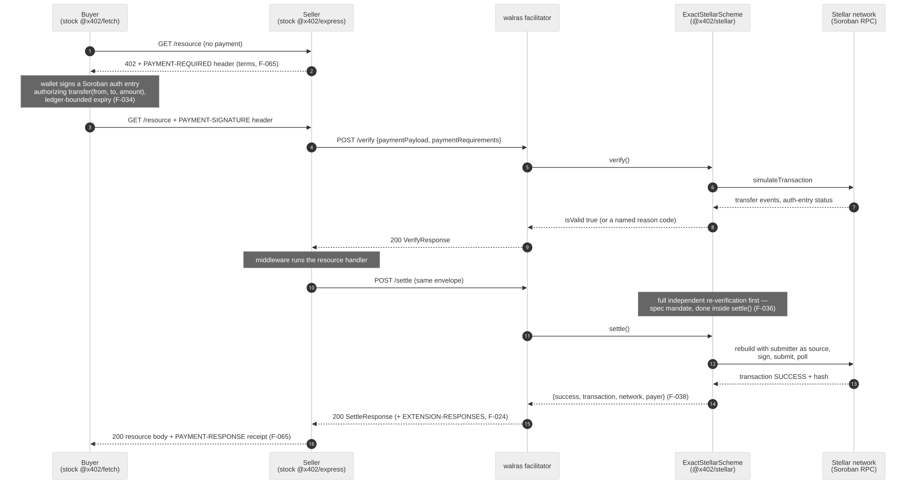
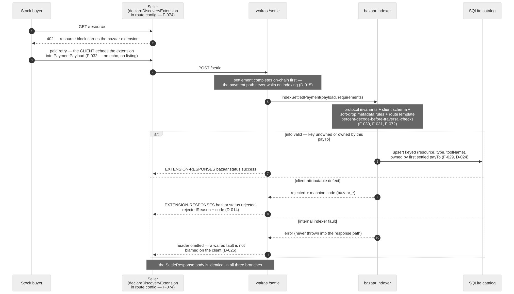
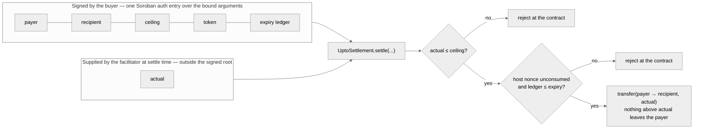

# walras — technical architecture

**An x402 facilitator and a settle-gated Bazaar discovery layer for Stellar.**
Apache-2.0 · [github.com/kunaldrall29/walras](https://github.com/kunaldrall29/walras) ·
built against the pinned spec commit
[`x402-foundation/x402 @ 17fc9890`](https://github.com/x402-foundation/x402/tree/17fc9890ade45a570a019352a3573391ad5d1e1f) ·
answers the SCF #45 RFP *"X402 Facilitator with Bazaar (discovery) support"*
([`rfp.md`](./rfp.md)).

walras turns HTTP 402 into a machine-native payment loop on Stellar and makes every
seller that settles through it discoverable to every agent that asks — with no
registration step anywhere. A stock x402 client pays a stock x402 seller; walras
verifies the buyer's Soroban authorization, sponsors the network fee, submits the
transfer, returns the on-chain hash, and — only after that outcome is decided —
catalogs the seller's declared resource so the next agent can find it. Payments are
non-custodial by construction: the facilitator's address is forbidden from appearing
anywhere in the client payload (F-035), and the submitter never holds the payment
asset (EVIDENCE S2-3).

This page is the complete architecture: what is built and how it is evidenced, what
each mechanism defends against and how that is monitored, and where the delivery
boundary of the grant sits. The as-built reference with file-level detail is
[`ARCHITECTURE.md`](./ARCHITECTURE.md); this page is the map.

**How to read the status markers.** Three markers appear throughout, and they are the
whole honesty contract of this document:

- [LIVE] — exercised on `stellar:testnet`; a transaction hash or a wire transcript is
  linked in the [evidence ledger](./EVIDENCE.md).
- [BUILT] — in the repository and covered by the hermetic test suite; not (or not
  yet) observed on-chain.
- [PLANNED: T1] / [T2] / [T3] — grant scope, tagged with the tranche that delivers it.
  Nothing under a PLANNED marker exists in the repository today.

Every mechanism cites a row in [`FACTS.md`](./FACTS.md) (`F-nnn`, a protocol or
library fact with its source and date), an entry in [`DECISIONS.md`](./DECISIONS.md)
(`D-nnn`, a point where the spec, the SDK, the reference operator, or the RFP
disagree and what walras does about it), or a section of [`EVIDENCE.md`](./EVIDENCE.md)
(`Sn-n`, a captured transcript or measurement). The citations are not decoration:
`pnpm docs:check` fails the build on any paragraph in this document that claims a
capability without an evidence reference, on any dated roadmap item, and on any dead
link.

## Verify it yourself

Every number on this page reproduces from a clean clone. Node ≥ 22 and pnpm 10
(`corepack enable`):

```bash
git clone https://github.com/kunaldrall29/walras && cd walras && pnpm install
pnpm test            # 225 hermetic tests — no secrets, no network (bazaar 76 · facilitator 99 · mcp-server 50)
pnpm eval:search     # search-quality harness: 28 labeled queries → recall@k, MRR@10, nDCG@10
pnpm docs:check      # generator drift, OpenAPI lint, stale diagrams, dead links, claims audit
./scripts/demo.sh    # five real settlements on stellar:testnet, fresh catalog → search → pay → auto-listed
```

The demo needs the `.env` that `node scripts/setup-accounts.mjs` prints plus one
manual testnet-USDC faucet visit; the whole path from clone to a paid, discoverable
endpoint was timed at about 100 s of machine time (EVIDENCE S5-5).

## Review entry points

- [Source repository](https://github.com/kunaldrall29/walras) — three packages, the
  demo, the eval harness, the gates.
- [Evidence ledger](./EVIDENCE.md) — every transcript, hash, and measurement;
  [facts](./FACTS.md) and [decisions](./DECISIONS.md) — every protocol claim and every
  divergence.
- [OpenAPI](./api/openapi.yaml), [error registry](./reference/errors.md), and
  [configuration reference](./reference/config.md) — all three are **generated from the
  code** by `pnpm docs:gen`; CI fails if they drift.
- [Conformance page](https://walras.space/conformance) — the checks, the dated evidence
  sections, and the settled transactions behind them.
- Continuous integration: [`ci.yml`](../.github/workflows/ci.yml) (tests, single-SDK
  check, license gate, search regression gate, docs gate) and
  [`live-settle.yml`](../.github/workflows/live-settle.yml) — a stock-client
  settlement on `stellar:testnet` on every push, with accounts created by Friendbot at
  run time and USDC bought on the DEX, so the repository holds no secrets and any fork
  reproduces the settlement by pushing ([run history](https://github.com/kunaldrall29/walras/actions/workflows/live-settle.yml)).
- [Threat model](./THREAT-MODEL.md), [runbook](./runbook.md), [data models](./MODELS.md),
  [litepaper](./litepaper/walras-litepaper.md).
- [The SCF submission document, republished verbatim](./scf/technical-architecture-submitted.md) —
  the grant document of record; this page supersedes it as the architecture reference
  but does not rewrite it.

## On this page

- [1. System overview](#1-system-overview)
- [2. Status at a glance](#2-status-at-a-glance)
- [3. Facilitator and exact settlement](#3-facilitator-and-exact-settlement)
- [4. Assets, trustlines, fees, and amounts](#4-assets-trustlines-fees-and-amounts)
- [5. Error model](#5-error-model)
- [6. Bazaar: settle-gated cataloging](#6-bazaar-settle-gated-cataloging)
- [7. Search and its evaluation](#7-search-and-its-evaluation)
- [8. MCP: discover, pay, retry](#8-mcp-discover-pay-retry)
- [9. The `upto` scheme](#9-the-upto-scheme)
- [10. Deployment and configuration](#10-deployment-and-configuration)
- [11. Threat model](#11-threat-model)
- [12. Monitoring plan](#12-monitoring-plan)
- [13. Testing and conformance](#13-testing-and-conformance)
- [14. Maintenance and spec drift](#14-maintenance-and-spec-drift)
- [15. Delivery boundary](#15-delivery-boundary)
- [16. What this document does not claim](#16-what-this-document-does-not-claim)

---

## 1. System overview

walras is three packages behind one service boundary, split along the seam the spec
itself draws: storing, indexing, and exposing discovered resources is "an
implementation detail" of the facilitator (F-023), so discovery lives in its own
transport-free library and the facilitator stays a payment component whose only
catalog knowledge is one settle-success hook and two GET routes.

| Package | Owns | Deliberately does not own |
| --- | --- | --- |
| `packages/facilitator` | The HTTP surface (`/verify`, `/settle`, `/supported`, `/health`, `/discovery/resources`, `/discovery/search`), configuration, the error model, kind routing, and the settle-time indexing hook | Payment validation. Every MUST of the exact-Stellar scheme is enforced by `@x402/stellar`'s `ExactStellarScheme`, which emits 37 machine-readable reason codes doing it; walras adds zero payment validation of its own (F-045) |
| `packages/bazaar` | Catalog persistence, the indexing trust boundary, search, and the wire mapping to the stock `DiscoveryResource` shape | HTTP — the facilitator mounts it |
| `packages/mcp-server` | The two agent tools `search_resources` and `paid_call`, the spend policy, and self-describing resource ids | Payment protocol and discovery semantics — it composes stock clients and the facilitator's public endpoints, and imports no facilitator internals (F-080) |



*Source: [`diagrams/system-components.mmd`](./diagrams/system-components.mmd).*

The boundaries, and what crosses each one:

- **Seller boundary.** A seller runs stock middleware — `@x402/express` for HTTP routes,
  `@x402/mcp`'s `createPaymentWrapper` for MCP tools — and declares price and discovery
  metadata in route configuration (F-074, F-093). walras never proxies, executes, or
  calls back into the seller's code, and the seller registers nothing anywhere: there is
  no registration endpoint (D-022).
- **Buyer boundary.** A stock client receives the 402, signs a Soroban authorization
  entry locally — an authorization of exactly `transfer(from, to, amount)` on the asset
  contract, not a pre-signed transaction (F-033) — and retries. Buyer secrets never
  reach walras. Network fees are sponsored, so the buyer holds only the payment asset
  and never spends a sequence number (F-006).
- **Facilitator boundary.** The scheme verifies the payload in a fixed order (F-035),
  rebuilds the transaction with a walras submitter as source, derives the fee from a
  fresh simulation (F-037), submits, and returns a receipt carrying the 64-hex on-chain
  hash (F-038). The facilitator address must appear nowhere in the client payload — not
  as transaction source, operation source, payer, or in any auth entry — and simulation
  must show exactly the expected balance change and nothing else (F-035). Balance
  accounting on the live conformance run is exact to the stroop: buyer −0.021 USDC,
  seller +0.021 USDC, facilitator −12 × 22 973 stroops of XLM, and the facilitator held
  USDC at no point (F-069, EVIDENCE S2-3).
- **Catalog boundary.** Cataloging runs after the settlement outcome is decided and
  cannot change it (D-015). Hostile or malformed metadata is soft-dropped with a machine
  code reported in the `EXTENSION-RESPONSES` header; a walras-internal indexer fault
  omits the header rather than blaming the client (D-025).
- **State boundary.** One SQLite file — Node's built-in `node:sqlite`, WAL journal mode,
  zero added database dependencies (D-023) — holds the catalog and its full-text index
  in the same transaction. There is no persisted settlement table: the on-chain
  transaction and the receipt returned to the seller are the record
  ([MODELS §3](./MODELS.md)).
- **On-chain boundary.** Stellar consumes the authorization's nonce, moves the SEP-41
  token, and charges the sponsored fee. Replay resistance is a property of the protocol,
  not a coded branch: a reused nonce makes re-simulation fail, and simulation success is
  a MUST (F-039, D-011).

Six invariants hold across every deployment and none is configurable:

1. **Non-custodial.** Funds move buyer → seller inside the client-signed authorization;
   the facilitator sponsors fees only (F-035, F-006).
2. **Indexing never touches settlement.** The settle response is produced from the chain
   result alone; a forced-failure test pins settlement success against a broken catalog
   store (D-015).
3. **Spec-verbatim wire shapes.** Every request and response shape is generated into the
   [OpenAPI document](./api/openapi.yaml) from the route schemas, and the live wire was
   diffed against the x402.org baseline with zero unexplained differences
   (EVIDENCE S2-5).
4. **Every rejection carries a machine-readable code and a non-null reason** — payment,
   catalog, query, or MCP path (D-007, D-028).
5. **Advertised support equals reachable support.** `/supported` lists `bazaar` because
   the discovery endpoints are mounted; it was an empty array until they were (D-016).
   A live counterexample of the failure this prevents — an operator advertising `bazaar`
   while both discovery endpoints 404 — is recorded at F-091.
6. **Permissive end to end.** Apache-2.0 with zero copyleft anywhere on the shipped
   dependency path, enforced by a two-tier license gate in CI (F-060, D-031). The
   AGPL OpenZeppelin Relayer path is neither used nor studied (F-015).

## 2. Status at a glance

| Capability | Status | Evidence |
| --- | --- | --- |
| `POST /verify`, `POST /settle`, `GET /supported` — a stock `@x402/fetch` buyer paid a stock `@x402/express` seller through walras | [LIVE] | tx [`ac50c091…cc155`](https://stellar.expert/explorer/testnet/tx/ac50c0910b3484ae6f2b070f35a95d1062dd3269cd4f877434dbcf2d7d3cc155), full wire transcript (F-066, EVIDENCE S2-2, S2-3) |
| The x402 repository's own e2e suite against walras (`--families=stellar --testnet`) | [LIVE] 4/4 | express and hono × fetch and axios, eleven settlements (F-067, EVIDENCE S2-4) |
| Negative paths with non-null reasons: replay, amount mismatch, expired authorization | [LIVE] | EVIDENCE S2-6; scripted as `./scripts/demo.sh --tampered / --expired / --poison-catalog` (S5-3) |
| Sponsored settlement fee: 22 973 stroops single-submitter, 23 073 with a fee-bump account | [LIVE] measured | F-069, F-086; matches the x402.org anatomy to the stroop (F-054, F-055) |
| Multi-submitter round-robin, `source_account` strictly alternating on Horizon | [LIVE] | F-095, EVIDENCE S7-2 |
| Settle-gated automatic cataloging with the outcome reported in `EXTENSION-RESPONSES` | [LIVE] | pay → listed, zero registration (F-075, EVIDENCE S3-3) |
| Hostile catalog writes soft-dropped with machine codes while their settlements succeed | [LIVE] | trivial-schema and wrong-payee attacks (EVIDENCE S3-4); the same binding on the MCP tuple (F-094) |
| `GET /discovery/resources` — seven spec filters, offset pagination | [LIVE] | EVIDENCE S3-3, S4-1; D-005 |
| `GET /discovery/search` — BASELINE FTS5/BM25, keyset cursor, truthful `partialResults` | [LIVE] | live probes incl. hostile syntax and an exactly-once cursor walk (EVIDENCE S4-4); offline quality (S4-3) |
| MCP server: an agent completed discover → pay using only `search_resources` and `paid_call` | [LIVE] | three receipts incl. an MCP tool cataloged by its own settlement (EVIDENCE S6-3) |
| A real third-party production tool — Policywright (SCF #44) — found, paid, and cataloged by an agent with zero prior integration | [LIVE] | txs [`3ff7309b…bf04`](https://stellar.expert/explorer/testnet/tx/3ff7309bc7641372265c4cbb89ddc314c430585085b1b2ccb0d4dbeea9f6bf04), [`980c3c59…8cc4`](https://stellar.expert/explorer/testnet/tx/980c3c5934b0405e501127d04fb246322a28afa8a610cbdfe48dcdd353c48cc4) (F-093, EVIDENCE S6-4) |
| One-command demo from a fresh clone, timed | [LIVE] | EVIDENCE S5-2, S5-5 |
| Real settlement in CI on every push, zero repository secrets | [BUILT] | [`live-settle.yml`](../.github/workflows/live-settle.yml) |
| Contract-account (`__check_auth`) payers | [BUILT] by source trace — not a live run | facilitator path is address-type-agnostic; blocker is client-side payload creation (F-096, EVIDENCE S0-8) |
| Fee-bump and round-robin composed in one run | not captured | each half captured separately (S7-1, S7-2) |
| Self-facilitation inside a resource server | [PLANNED: T1] | seam exists — `buildServer` takes injected config and store ([ARCHITECTURE §6.3](./ARCHITECTURE.md)) |
| Channel-account pool manager, durable idempotency and lost-response recovery, RPC failover, sponsorship budgets, caller authentication and rate limiting | [PLANNED: T1] | [§3](#3-facilitator-and-exact-settlement), [§10](#10-deployment-and-configuration) |
| Hybrid search — BM25 fused with embeddings — and an expanded graded query set | [PLANNED: T2] | [§7](#7-search-and-its-evaluation) |
| `upto` scheme: Stellar specification, settlement contract, facilitator validation, upstream PR | [PLANNED: T2] | no `upto` code exists in this repository (F-005); [§9](#9-the-upto-scheme) |
| Threat-model-derived alerts demonstrated firing against the live testnet deployment | [PLANNED: T2] | [§12](#12-monitoring-plan) |
| Third-party audit via the Audit Bank, then `stellar:pubnet` activation | [PLANNED: T3] | [THREAT-MODEL §4](./THREAT-MODEL.md) |

## 3. Facilitator and exact settlement

The facilitator is a **wrapper**, and the wrapping line is drawn deliberately.
`ExactStellarScheme` already enforces every MUST in `scheme_exact_stellar.md` (F-045);
a stricter wrapper would reject payloads the reference client legitimately produces,
and a looser one would be a fork (D-008). walras adds the HTTP surface, configuration,
the error model, kind routing, and the settle-time hook — nothing else.



*Source: [`diagrams/payment-settlement-sequence.mmd`](./diagrams/payment-settlement-sequence.mmd).
The full wire transcript of exactly this flow, stock client on both sides, is EVIDENCE S2-2.*

The path, with the load-bearing facts:

1. The buyer's first request carries no payment; the seller answers **402** with
   `PaymentRequirements` in the `PAYMENT-REQUIRED` header — the v2 canonical name
   (F-065). Requirements name the CAIP-2 network, the SEP-41 asset contract, the
   integer base-unit amount, `payTo`, and `maxTimeoutSeconds`.
2. The buyer's wallet signs a **Soroban authorization entry** for exactly
   `transfer(from, to, amount)` on the asset contract (F-033). Validity is
   ledger-bounded: `ceil(maxTimeoutSeconds / estimatedLedgerSeconds)` ledgers from now
   (F-034).
3. The seller's middleware POSTs `{x402Version, paymentPayload, paymentRequirements}`
   to `/verify` (F-089). The scheme checks, in order: protocol shape, transaction
   structure (one operation, contract equals `asset`, `transfer` with three arguments,
   recipient equals `payTo`, amount exact as i128), **facilitator safety**, then
   **enforcing-mode simulation**, and only after simulation succeeds the auth-entry
   checks (credential type, no sub-invocations, all signers signed, expiry bound) and
   the transfer-event checks (F-035, F-064). Simulation is the cryptographic control,
   not defence in depth: the package's own signature check tests only that a signature
   is *present*, so a forged authorization is caught exclusively by the Soroban host
   during simulation (F-062).
4. On `isValid: true` the seller does its work, then POSTs the same envelope to
   `/settle`. Settle **re-verifies in full** — a spec mandate executed inside the
   scheme's own `settle()` (F-036) — so walras runs no wrapper-level pre-verify, which
   would double every simulation and add no safety.
5. The scheme rebuilds the transaction with a walras submitter as source (the buyer's
   signed auth entry rides along unchanged), derives the fee from a fresh settle-time
   simulation plus an inclusion buffer, fully overriding the client's fee bid, under a
   configurable ceiling of 50 000 stroops (F-037), signs, submits, and polls to a
   terminal state. The receipt is `{success, transaction, network, payer}` (F-038).
6. The seller returns **200** with the resource and forwards the receipt in
   `PAYMENT-RESPONSE` (F-065).

**HTTP status convention.** A payment the scheme rejects is a **200** carrying
`isValid: false` or `success: false` with the reason code — a successful exchange about
an invalid payment, matching the reference facilitator. **4xx** is reserved for requests
that could not be interpreted as an x402 exchange at all, and even those are rendered in
the protocol shape so a stock client's error path keeps the machine-readable code.

**`/supported`** is served straight from the package: `kinds`, `extensions`, and
`signers`, all three required (F-040). The Stellar kind carries
`extra.areFeesSponsored: true`, byte-identical to both independent public operators'
captures (F-041, F-090), and a test asserts it against the captured baseline value.

**Throughput posture.** Stellar serializes submissions per source account by sequence
number, and agent traffic is bursty. The package already ships the two mechanisms the
reference operator runs in production (D-012): `SUBMITTER_SECRET` accepts a
comma-separated list and settlements rotate across submitters (F-044) — observed live
with `source_account` alternating SUB1/SUB2/SUB1/SUB2/SUB1 across five consecutive
settlements at a median 5.18 s settle latency (F-095, EVIDENCE S7-2) — and
`FEE_BUMP_SECRET` wraps each settlement in a fee-bump transaction so fee payment is
decoupled from sequence management (F-047), observed live at exactly the predicted
100-stroop premium (F-086, EVIDENCE S7-1). The composed posture — rotation *and* fee
bump in one run — has not been captured; each half has.

[PLANNED: T1] **the production submission layer**, which the pre-build demonstrates the
mechanism for but does not manage: a channel-account pool sized to observed load
(accounts that exist only to supply sequence numbers, leased with a TTL, quarantined on
any submit error, reconciled against the ledger before return, and checked at boot —
mismatch refuses to start); a durable settlement table keyed on `(signer, nonce,
contract)` so the auth-entry nonce is both the replay defense and the idempotency key,
giving lost-RPC-response recovery by hash lookup instead of blind resubmission; and RPC
failover across two providers health-checked on ledger freshness, with disagreement
treated as an alarm rather than a routing choice. As built, a process that dies between
submission and response leaves recovery to the operator's Horizon walk
([runbook §7](./runbook.md)) — stated, not hidden.

## 4. Assets, trustlines, fees, and amounts

- **Scope is SEP-41 Soroban tokens only**; classic Stellar assets are not supported by
  the scheme (F-033). USDC is the documented default with **seven** decimals, and
  amounts are integer base-unit strings end to end (F-008). The testnet USDC contract
  `CBIELTK6…DAMA` was verified four independent ways — spec, package constant, on-chain
  ledger entry, and cryptographic re-derivation from the classic asset (F-052). The
  mainnet constant is taken from the package and has **not** been independently verified
  on pubnet (F-053).
- **Trustlines are the seller's onboarding concern.** A classic `G…` recipient needs a
  USDC trustline before it can receive, and each trustline raises the account's minimum
  balance by one base reserve of 0.5 XLM — invisible on testnet, real on pubnet (F-085).
  walras creates no trustlines and bypasses no issuer controls; the demo's
  `setup-accounts.mjs` creates them for the demo accounts, and the
  [sell guide](./guides/sell.md) covers the rest.
- **Fee sponsorship covers the network fee only.** The buyer never spends XLM or a
  sequence number (F-006); the facilitator's submitter holds no USDC at any point
  (EVIDENCE S2-3). The fee is not in the receipt — it is an on-chain fact read back from
  Horizon: 22 973 stroops on the single-submitter path (F-069), 23 073 on the fee-bump
  path (F-086). Versus the default 50 000-stroop ceiling, that is roughly 2× headroom
  (F-037).
- **Amount is exact, not "at least".** `wrong_amount`, `wrong_recipient`, and
  `wrong_asset` fire before any network call (F-064).
- **Expiry is ledger-bounded** (F-034). One inherited deviation, disclosed rather than
  forked away: the package tolerates expiry two ledgers beyond the spec's strict bound to
  absorb RPC skew (F-046, D-008).
- **`stellar:pubnet` is configuration-supported, never exercised.** Pubnet has no public
  default RPC, so `RPC_URL` is required there (F-004); every settlement on this page is
  testnet.

## 5. Error model

Four disjoint taxonomies, 65 codes, all rendered into the generated
[error registry](./reference/errors.md):

| Taxonomy | Count | Where it appears |
| --- | --- | --- |
| Inherited scheme codes — verify path | 30 | `invalidReason` on `/verify` and, because settle re-verifies, on `/settle` |
| Inherited scheme codes — settle path | 7 | `errorReason` on `/settle` |
| `walras_*` envelope codes | 10 | malformed bodies, unsupported kinds, unknown routes, query interpretation — before the scheme is consulted |
| `bazaar_*` soft-drop codes | 7 | the `bazaar` object in `EXTENSION-RESPONSES` on `/settle` |
| `walras_mcp_*` tool codes | 11 | `{errorCode, reason}` results from the MCP server |

The 37 inherited codes pass through verbatim and are never shadowed or renamed
(D-007). The package populates a human-readable message on exactly one of its paths, so
walras backfills the rest — that is what makes "non-null reason on every rejection" true
by construction. A test greps the *installed* package bundle for its reason-code
literals and fails if the set differs from the enumeration, so an upstream rename breaks
the build instead of silently degrading a rejection (F-063). Stock consumers see the
codes: the stock facilitator client parses `EXTENSION-RESPONSES` and logs
`status`, `rejectedReason`, and the additive machine `code` (F-073, D-014).

## 6. Bazaar: settle-gated cataloging

The Bazaar is an **off-chain index derived from seller-declared metadata**, and that is
a design position: an on-chain registry adds rent that must be extended or entries
evict, and per-payment anchoring roughly doubles settlement cost, for a property
discovery does not need — a poisoned catalog entry costs an agent one wasted request,
never funds, because the payment itself is independently bound to recipient, asset, and
amount inside the signed authorization (F-033). Decentralization comes from
replicability ([§10](#10-deployment-and-configuration)), not from a registry contract.



*Source: [`diagrams/auto-catalog-sequence.mmd`](./diagrams/auto-catalog-sequence.mmd).
Proven live: pay → listed with zero registration (EVIDENCE S3-3); hostile writes
soft-dropped while their settlements succeeded (S3-4).*

**Listing is settle-gated, and that is policy, not conformance.** The spec does not
require cataloging to be gated on settlement (F-023); walras gates it deliberately
(D-004) because a listing that costs a real on-chain settlement is the cheapest
anti-spam control that needs no accounts, no reputation, and no moderation — and it is
why no registration endpoint exists (D-022). The seller cannot force a listing either:
if the client omits the echoed extension, nothing is cataloged (F-032).

**Identity.** HTTP resources are keyed on the canonical URL — `origin + routeTemplate`
when the seller declared a valid template, else `origin + pathname`, query and fragment
stripped (F-051). MCP tools are keyed on the tuple `(resource.url, input.toolName)`, a
spec MUST because one MCP endpoint multiplexes many tools (F-029); the reference e2e
catalog keys on URL alone and lets two tools overwrite each other, a defect walras
deliberately does not share (D-009). Every listing is **owned by the `payTo` of the
first settled payment that created it** — the only client-independent identity signal
in a settle-gated catalog, because the scheme verified on-chain that the transfer
credits it (D-024). Same key and same owner refresh the listing; a different owner is
rejected `bazaar_listing_owned_by_other_payee` inside one `BEGIN IMMEDIATE`
transaction, so two concurrent settlements cannot race the check.

**The indexing invariant has a mechanism, not a promise** (D-015, D-025):

- The settle response is produced from the chain result alone; the hook runs afterwards
  and never throws by contract, with a belt-and-braces catch in the route.
- Its work is structurally bounded: a 64 KiB cap on the extensions block before any
  validation touches it, regex-bearing schema keywords stripped and a node-count cap
  applied before Ajv compiles anything (a ~140-byte evil-pattern schema measured 36 s of
  synchronous compute in the SDK's own validator — F-087, D-033), a 100 ms database busy
  timeout, and a 250 ms soft budget that logs a warning.
- Its outcome only decorates the response: `success`, or `rejected` with a
  human-readable `rejectedReason` plus a machine `code` (F-024, D-014). Field-level
  defects — `serviceName`, `tags`, `iconUrl`, `routeTemplate` — drop the *field* and
  keep the listing, and are recorded in a `soft_drops` audit table (F-031, D-033).

**The trust boundary.** Clients echo the resource block into the payment payload, so
every byte of it is hostile until validated, and the SDK's one-shot extractor is
explicitly *not* that boundary — it validates only against the client-supplied schema
and never calls the protocol-invariant check (F-072). walras composes the low-level
validators itself:

| Threat | Control as built | Exercised by |
| --- | --- | --- |
| Poisoning via a trivial client schema | Protocol-invariant validation in addition to client-schema validation; either failure soft-drops with a code (F-072) | Unit (S3-2); live garbage extension → `bazaar_spec_validation_failed`, settlement untouched (S3-4) |
| Overwriting another seller's listing with a real settled payment | Owner binding to the settled `payTo` (D-024) | Live wrong-payee settlement → `bazaar_listing_owned_by_other_payee`, listing byte-identical after (S3-4); the same on the MCP tuple against Policywright's listing (F-094, S6-4) |
| Traversal or scheme-smuggling hidden in `routeTemplate` | The SDK decodes once, so `%252e%252e`, `//host`, and `%00` pass it (F-088); walras adds bounded repeated decode and rejects null bytes, backslashes, and protocol-relative forms *before* the SDK check (D-033) | Poisoning suite incl. the double-encode and null-byte cases the SDK alone would pass (S3-2) |
| Regex denial of service through the client's schema | Regex keywords stripped, node budget applied before compilation; over-budget schemas soft-drop `bazaar_schema_too_complex` (D-033) | The evil-pattern schema now indexes in under a second (S3-2) |
| Hostile service metadata — oversized names, tag floods, dangerous icon hosts | Per-field soft-drop rules with percent-decode before IP and loopback checks (F-031) | Metadata suites (S3-2) |
| Two MCP tools on one URL colliding | Tuple keying (F-029) | Live: an MCP tool cataloged beside the HTTP listing on the same origin (S6-3) |

**Disclosed limitations, stated as limitations:**

- **URL squatting is not prevented.** A settled payment carries no proof that its
  `payTo` controls the echoed origin, so whoever settles first for a key owns it, and
  the real seller's later honest settlement is rejected. An attacker-first regression
  test pins the real behavior rather than claiming a defense (D-032). Blast radius is
  bounded by design — the catalog's `accepts` is advisory and a protocol-following buyer
  always pays against the live 402 from the resource server itself, so a squat pollutes
  metadata and denies a listing but cannot redirect funds. [PLANNED: T1]
  proof-of-origin-control at index time.
- **Micro-settlement spam is priced, not prevented.** A self-paying attacker sets its
  own price and the operator bears the sponsored network fee (~0.0023 XLM, F-069);
  nothing prunes stale listings yet, and the reference operator's 30-day rule (F-012)
  is noted, not adopted. [PLANNED: T1] configurable caller authentication, rate limits,
  and a retention policy.
- **Federation across independently operated catalogs** is an interop direction, not a
  delivered feature.


*Source: [`diagrams/payment-lifecycle-state.mmd`](./diagrams/payment-lifecycle-state.mmd).
Every terminal state carries a non-null reason; everything below `Settled` runs off the
settlement path and cannot change its outcome (D-015).*

## 7. Search and its evaluation

`GET /discovery/search` is spec-shaped end to end: the required parameter is `query`,
not `q` (D-006); the same filters as the list endpoint; a `resources` array where the
list endpoint returns `items` — an asymmetry the SDK types define and a stock
`withBazaar` client depends on (D-001); an explicit `partialResults` that means exactly
"matches were truncated" (D-027); and real keyset cursor pagination although the spec
makes it advisory and no reference operator implements it (D-003, F-013).
`pagination.limit` is the count in *this* page, not the requested maximum (F-077).

The pipeline is a **`Retriever`** — a one-method seam, `query → ranked ids + scores` —
whose ranking the shared filter semantics intersect and the cursor slices. Ranking can
therefore change without touching the wire contract, the filters, or pagination.

**BASELINE retriever** [LIVE]. The pre-build ships exactly one implementation, labeled
BASELINE in code and documentation (D-026): SQLite FTS5 with BM25 over four weighted
fields — service name 4.0, description 2.0, parameter text 1.0, tags 3.0 — with the
weights rule-of-thumb and explicitly untuned. Parameter text is parameter *names* plus
JSON-Schema `description` annotations; example *values* are deliberately not indexed,
because an example city of "Zurich" says nothing about what a resource does. Untrusted
queries are compiled to quoted-token OR expressions, since raw FTS5 syntax throws on
operator characters (F-076). There is no stemming, no stopword handling, and no synonym
expansion — and the evaluation set contains queries chosen to fail on exactly those
gaps.

**Evaluation is the deliverable that keeps ranking honest.** `pnpm eval:search` builds
a fixture catalog from `eval/search/corpus.json` **through the production indexing
path**, runs the 28 labeled queries in `eval/search/queries.json`, and reports
(EVIDENCE S4-3, independently reproduced in a clean clone in S5-1):

| Metric | BASELINE |
| --- | --- |
| recall@1 | 0.839 |
| recall@3 / recall@5 | 0.929 / 0.929 |
| MRR@10 | 0.911 |
| nDCG@5 / nDCG@10 | 0.909 / 0.909 |
| zero-result queries | 0 of 28 |

The misses are the planted vocabulary-gap probes — "US dollars to euros" against a
corpus that says USD/EUR, "did it snow" against "snowfall", "apple share price" ranked
behind crypto prices — and they are the measured acceptance tests for the upgrades
below (EVIDENCE S4-3). The harness is wired into CI as a **regression gate**: a run
whose nDCG@10 falls more than 5 % below the committed
[`baseline.json`](../eval/search/baseline.json) fails the build, and so does a corpus
hash change, so the baseline can only move deliberately, alongside the retriever change
that moves it.

**Ranking neutrality as built.** The BASELINE ranking function's only inputs are the
query and the four indexed fields (D-026). There is no listing attribute — house-owned
or otherwise — that the retriever can read, so operator preference has no channel to
express itself. When settlement-derived quality signals arrive
([PLANNED: T2] distinct buyers, volume, recency, metadata completeness, ordering results
*after* relevance retrieves them), a neutrality test will assert that flipping a
display-only house flag changes zero orderings across the golden set.

[PLANNED: T2] **the ranking upgrade path**, in measurement order, each step landing only
if it moves the harness's numbers: lexical hygiene (stopwords, light stemming) → hybrid
retrieval (BM25 fused with dense embeddings computed at index time, reciprocal rank
fusion first because it needs no calibration between incomparable score scales and
degrades gracefully when one retriever returns nothing) → cross-encoder re-ranking over
the fused top-k. An embedding-provider outage returns lexical results with
`partialResults: true`, never an error, and a self-hosted instance boots and searches
with no model credentials at all. The golden set grows from the real catalog with graded
judgments and a published methodology; the gate is kept honest by a committed,
deliberately regressing fixture, because a gate nobody has watched fail is a gate nobody knows
works — the vocabulary-gap misses recorded in EVIDENCE S4-3 are the first such fixture. Online signals never create relevance labels and never rewrite seller-authored
text: seller metadata is the only source of catalog claims.

## 8. MCP: discover, pay, retry



*Source: [`diagrams/discovery-agent-flow.mmd`](./diagrams/discovery-agent-flow.mmd).
Proven live with a generic MCP client carrying zero walras and zero `@x402/*` imports
(EVIDENCE S6-3).*

Two tools over stdio, and the whole discover → pay loop behind them. `@x402/mcp`
supplies the payment-aware client and the server-side tool wrapper and nothing else — no
discovery tools, no MCP→HTTP bridge, no catalog resolution — so the tools, the bridge,
and the id scheme are entirely this repository's build (F-080):

- **`search_resources(query, filters?)`** — ranked catalog search through the
  facilitator's public `/discovery/search`. Each hit carries a deterministic,
  self-describing id — `wr1:` plus a base64url encoding of the listing tuple, minted
  identically on every server and re-resolved against the live catalog before any
  payment (D-029) — the price in base units, the network, and the machine-readable
  calling convention: method and example values for HTTP, the inline `inputSchema` for
  MCP (F-082).
- **`paid_call(resourceId | url [+ toolName], input?)`** — resolves the target, probes
  its live 402, applies the spend policy, pays through the stock client path (`@x402/fetch`
  for HTTP, the `@x402/mcp` client for tools), and returns the result plus a receipt
  `{transaction, network, payer}`.

**Every failure is a structured `{errorCode, reason}` tool result** — never a thrown
free-text error — with facilitator codes passed through verbatim and dual-format
content per the MCP transport spec (F-079, D-028). Live in the same session:
`walras_mcp_unknown_resource_id` for a stale id and the facilitator's own
`walras_invalid_search_cursor` surfacing unchanged through the tool (EVIDENCE S6-3).

**Spending is bounded twice.** The per-call cap (`WALRAS_MCP_MAX_AMOUNT`, default
1 USDC) binds as a pre-payment check against the probed 402 *and* as a
`registerPolicy` filter on the one shared `x402Client`, so a fresh 402 with a raised
price hits the policy even though the pre-check saw the old one; foreign-network
demands are declined the same way, and tests assert the paying seam is never invoked on
a declined call (F-081, D-030).

**Key posture, as built.** The MCP server is a *local* component that runs beside the
agent. It pays only when `CLIENT_STELLAR_PRIVATE_KEY` is set in its own environment;
unset, it runs search-only and `paid_call` names the gap (D-030). Nothing about it is
hosted, and it consumes only the facilitator's public endpoints — it never imports
facilitator internals or opens the catalog database (F-080). Smart-account payers
compose at the signer: the facilitator path is address-type-agnostic and a contract
account's `__check_auth` executes inside enforcing-mode simulation, so custom policies
never need to be disclosed to walras; the blocker for a live contract-account run is
client-side payload creation in the package, traced but not executed (F-096).
[PLANNED: T2] a hosted, **keyless** discovery profile at `mcp.walras.space` (its DNS
record is not created before it ships — a resolving host that returns nothing is worse
than NXDOMAIN) and an auth-entry-shaped signer interface so an Ed25519 keypair and a
smart-account wallet travel the same client-side path.

**The acceptance case is a tool that is not ours.** Policywright (SCF #44) exposes a
pure `synthesize` capability — recorded Soroban transaction in, least-privilege
OpenZeppelin smart-account policy out, no I/O and no clock reads, so a paid call is
deterministic. It is served as a paid MCP tool behind walras using only the stock SDK
(`createPaymentWrapper`, F-080). A generic MCP agent with zero prior integration
searched (empty — pay-to-list), paid the tool by `(url, toolName)`, and that settlement
cataloged it; the agent re-found it and paid it again by minted id, with byte-identical
output and fees of 22 973 stroops each (F-093, EVIDENCE S6-4). An attacker echoing the
tool's exact tuple with its own `payTo` settles on-chain and is rejected
`bazaar_listing_owned_by_other_payee`, the listing untouched (F-094). Scope stated
plainly: the integration lives in Policywright's repository, walras imports nothing from
it, and it is one early tool — not Policywright's own MCP-server deliverable (D-037).

## 9. The `upto` scheme

**Status: [PLANNED: T2] — design, not implementation.** `@x402/stellar` implements the
exact scheme only, and no Stellar `upto` specification exists at the pinned commit
(F-005). No `upto` code exists in this repository. What follows is the design the grant
delivers, with its assumptions named.

`exact` fixes the amount at signing time; metered services — token billing, bandwidth,
compute — need "authorize up to a cap, settle actual usage". On Stellar this **requires a
contract**, and the reasoning is structural. A Soroban authorization commits to the
exact invocation arguments, so a signed direct `transfer` is a fixed amount. The obvious
contract-free primitive, a SEP-41 allowance plus `transfer_from`, genuinely provides a
cap and a ledger-bounded window but fails two mandatory properties: it binds
`(from, spender)` and an amount, **not a recipient**, and a standing allowance is
**drawable again** — a facilitator could split it across settlements or direct value to
a recipient the buyer never named, and nothing on-chain would distinguish that from
honest metering. That is the trust gap the RFP itself names, and any contract-free
design must state it as a weaker trust profile rather than engineer around it with
assertions ([litepaper §8](./litepaper/walras-litepaper.md)).



**The contract is deliberately minimal**: single-function, no administrator, no upgrade
path, no application-defined persistent storage, and it never holds a balance. The
client signs one authorization via `require_auth_for_args` over the bound argument list
— ceiling, recipient, token, time bound — deliberately excluding the actual amount,
which is supplied at settle time and enforced `actual ≤ ceiling` in contract logic; the
Soroban host nonce and the ledger deadline give single use and time bounding. Three
rejection rules define the scheme and are what its acceptance tests check: a payload
whose signed root includes the actual amount is rejected (that is `exact`, not `upto`);
a settlement targeting any contract other than the address advertised in `/supported`
is rejected at the operation level, before anything else is considered; and above-ceiling
and replayed payloads are rejected **at the contract**, not merely at the facilitator —
the contract must be safe against a malicious facilitator, which is the entire reason it
exists. Facilitator-side validation for the scheme is new security-critical code with
its own shape checks and its own error codes.

**Composition with smart-account spending policies.** The signed tree exposes ceiling,
recipient, and token, so an account policy can enforce per-window budgets and
allow-lists across *any* facilitator: the account caps total outflow, the contract caps
this settlement and binds its recipient — two independent limits with different trust
assumptions and no shared failure mode. The pre-build's client-side spend cap (D-030) is
the application-layer sketch of the same idea, and the facilitator path already executes
a contract account's `__check_auth` inside enforcing-mode simulation (F-096).

**Named assumptions, resolved on testnet before the specification is finalized** —
if reality differs, the spec changes, not the test: that the facilitator's auth-tree
shape checks accept the contract's `require_auth_for_args` tree; that the settlement fits
within Soroban resource limits under the facilitator's fee ceiling; and that the
contract's ledger-entry TTL covers the authorization's deadline window. The scheme's
audit scope is bounded to match: one function, no storage, no custody, reviewed
separately from the off-chain service. `scheme_upto_stellar.md` is authored alongside
and contributed upstream through the x402 Technical Steering Committee (F-016).
`batch-settlement` and `auth-capture` are deferred per the RFP and not foreclosed —
scheme dispatch is a table, not a rewrite.

## 10. Deployment and configuration



*Source: [`diagrams/deployment-topologies.mmd`](./diagrams/deployment-topologies.mmd).*

**The footprint is one process and one file.** A facilitator instance is a single
Node.js process plus one SQLite file for the catalog — no external database, no message
queue, no proprietary cloud dependency (D-023). The only credentials it holds are its own
Stellar submitter seed(s), supplied by environment variable and never echoed in errors,
logs, or `/health`, which carry public addresses only ([THREAT-MODEL §1](./THREAT-MODEL.md)).
Every capability on this page was exercised on exactly this footprint against the public
testnet RPC (EVIDENCE S2-2 through S6-4).

- **Hosted** — one operator runs walras for many sellers; the shared catalog is the
  point, and every transcript in the evidence ledger runs this topology (D-004). Nothing
  about the protocol privileges the hosted instance, and there is no public hosted
  facilitator yet — the walras.space Browse page ships its empty state rather than
  specimen data (D-039).
- **Self-hosted** — the same code, run by anyone: `git clone`, set `SUBMITTER_SECRET`,
  start ([runbook](./runbook.md)). Apache-2.0 with a copyleft-free dependency path is what
  makes this real rather than nominal (F-060, D-031). A self-hosted instance catalogs
  what settles through *it*.
- **Self-facilitation inside a resource server** — [PLANNED: T1]. The seam exists as
  built: `buildServer` takes injected configuration and store, and the test suite drives
  the whole app in-process with no socket; the packaged embedding mode
  (verify/settle/discovery mounted inside an Express or Fastify resource server, sharing
  the catalog store) does not ship in the pre-build.

**Configuration fails closed.** Invalid configuration exits with `EX_CONFIG` (78)
**before a port is bound**, naming the variable — a facilitator that starts on half-valid
configuration would advertise capability it cannot honour. The full table is generated
from the in-code `CONFIG_REFERENCE` and drift-tested: [configuration reference](./reference/config.md).
The facilitator surface is `NETWORK`, `RPC_URL` (required on pubnet, F-004),
`SUBMITTER_SECRET` (one seed or a comma-separated list), `FEE_BUMP_SECRET`, `PORT`,
`FEE_MODE` (only `free` is implemented; anything else is a startup error, distinct from
`areFeesSponsored`, which is about network fees and always true — F-006), `DB_PATH`, and
`MAX_TRANSACTION_FEE_STROOPS` (F-037). The MCP server adds `FACILITATOR_URL`,
`WALRAS_MCP_NETWORK`, `WALRAS_MCP_MAX_AMOUNT`, and `CLIENT_STELLAR_PRIVATE_KEY` (D-030).
[PLANNED: T1–T3] caller authentication, rate windows, sponsorship budgets, channel-pool
sizing, retention, RPC failover thresholds, metrics and tracing exporters, and alert
thresholds — required delivery controls, not represented as already-implemented keys.

**Continuous integration has a live half.** [`ci.yml`](../.github/workflows/ci.yml) runs
the single-SDK assertion (two copies of the Stellar SDK produce XDR objects that fail
`instanceof` across the boundary — F-059, D-013), the two-tier license gate, build,
typecheck, all suites, the search regression gate, and the docs gate.
[`live-settle.yml`](../.github/workflows/live-settle.yml) then proves the money movement:
on every push it creates throwaway accounts through Friendbot, buys testnet USDC on the
DEX with no captcha faucet, and runs the demo's happy path — a stock buyer pays a stock
seller through walras and the settled hash lands in the job summary. The repository holds
**no secrets**, which is what makes the settlement reproducible by any fork.

**The documentation site sits outside the gates, by design.** docs.walras.space is
deployed manually; the commit stamped in every page footer is the authority on what a
reader is looking at, and `pnpm check:site` compares it against the tree — deliberately
not in CI, because a stale deploy is an ops condition, not a broken commit (F-092, D-035).

[PLANNED: T1–T3] **the hosted production shape**, stated as design rather than
described as operated: SQLite remains the self-host default while the hosted deployment
moves settlement state to PostgreSQL — the idempotency and recovery table, where a
dropped write would be a double-spend of the buyer's authorization and durability beats
latency — with pgvector added when semantic retrieval lands; Redis for channel leases and
rate limits, ephemeral by design, so losing it costs a pool reconcile and never
correctness; a public-readable object store for CI transcripts as the evidence trail;
two Soroban RPC providers with divergence alarms; the treasury key in a KMS with a
documented rotation drill, channel accounts sponsored from it; and a published SLO only
after there is measurement history behind it. The hosting provider, monitoring stack,
and mainnet RPC choice are not yet stood up.

## 11. Threat model

The threat model follows the four questions of the
[Stellar threat-modeling guide](https://developers.stellar.org/docs/build/security-docs/threat-modeling)
and its STRIDE template; the full STRIDE-lite table with a test or transcript per
control is [`THREAT-MODEL.md`](./THREAT-MODEL.md). Status: **testnet, unaudited.**

**What are we working on.** The data-flow diagram is the trust-boundary map below.
Everything in the top box is client-controlled and hostile until validated (F-072).


*Source: [`diagrams/trust-boundaries.mmd`](./diagrams/trust-boundaries.mmd).*

Assets worth protecting, in order: the submitter seeds (the only credential an instance
holds); the operator's XLM, which sponsors every settlement; the correctness of the
buyer's authorization — walras never holds buyer funds, but a verification bug could let
a payment settle that should not; the catalog's integrity, meaning listing identity and
seller-authored text; and the availability of the payment path, which cannot exceed the
availability of the Soroban RPC. Entry points: `/verify` and `/settle` (a client-built
transaction plus auth entries), the echoed discovery extension on `/settle`, the
discovery query strings, and the MCP tool arguments.

**What can go wrong, and what is done about it** — the highest-severity rows, in the
template's `Category.#` form, each mapped to the monitor in [§12](#12-monitoring-plan)
that detects it:

| ID | Threat (STRIDE) | Control as built | Exercised by | Monitor |
| --- | --- | --- | --- | --- |
| Tamper.1 | Forged or altered authorization signature | Enforcing-mode simulation is the sole cryptographic control; the package checks presence only (F-062, F-035) | Modelled with real Ed25519 verification (S1-4); live collapse to `…_simulation_failed` (S2-6) | M7 |
| Tamper.2 | Requirements tampered — amount, recipient, or asset differ from what the client signed | Pre-simulation argument equality; `wrong_amount` and siblings fire before any network call (F-064) | Live amount mismatch (S2-6); demo `--tampered` (S5-3) | M7 |
| Spoof.1 | Replay of a settled payload | Structural: the auth-entry nonce is consumed on-chain, re-simulation fails (F-039, D-011); no application replay cache exists, deliberately | Live replayed payload rejected at `/settle` (S2-6) | M7 |
| Tamper.3 | Expiry race — an entry used past its ledger bound | Ledger-bounded expiry derived from `maxTimeoutSeconds` (F-034); two-ledger inherited tolerance disclosed (F-046, D-008) | Live expired entry rejected on both routes (S2-6); demo `--expired` (S5-3) | M7 |
| Elev.1 | Front-running — an observer lifts the signed entry to redirect or drain it | Recipient, amount, and asset sit inside the signed preimage (F-033); one nonce, one settlement (F-039); the facilitator refuses to be source, payer, or auth participant (F-035) | Reduces structurally to the `wrong_*` fixtures (S1-2) and the replay test (S2-6) | M4 |
| DoS.1 | Fee-bid manipulation to drain the sponsor | Client fee bid fully overridden from a fresh settle-time simulation under a hard ceiling (F-037) | Ceiling code in the fixture suite (S1-2); fees measured 22 973 / 23 073 stroops (F-069, F-086) | M1, M2 |
| DoS.2 | Free `/verify` simulation as a denial-of-service vector; sponsor drain by volume | **Not yet controlled** — no caller authentication or rate limiting exists (RFP 3.1 leaves the mechanism to the operator) | — | M12, M13 [PLANNED: T1] |
| Tamper.4 | Catalog poisoning through a trivial client schema | Protocol invariants validated in addition to the client schema (F-072) | Unit (S3-2); live (S3-4) | M9 |
| Spoof.2 | Overwrite of an existing listing by a different `payTo` | Owner binding to the settled recipient, transactional check-and-write (D-024) | Live on HTTP (S3-4) and on the MCP tuple (F-094) | M11 |
| Spoof.3 | URL squatting — claiming a URL before its owner ever settles | **Not prevented; disclosed** (D-032). Blast radius bounded because the catalog is advisory | Attacker-first regression test pins the real behavior (S3-2) | M11 |
| Tamper.5 | Hostile `routeTemplate` — traversal or scheme-smuggling behind percent-encoding | Bounded repeated decode plus null-byte, backslash, and protocol-relative rejection ahead of the SDK's single-decode check (F-088, D-033) | Poisoning suite (S3-2) | M9 |
| DoS.3 | Indexer as settlement hostage — a poisoned write stalling payments | Outcome decided before the hook; never throws; 64 KiB cap; regex keywords stripped and node count capped before Ajv (F-087, D-033); forced-failure test (D-015) | The evil-pattern schema indexes in under a second; settlement succeeds against a broken store (S3-2) | M10 |
| DoS.4 | FTS5 operator injection in `query` | Queries compiled to quoted-token expressions; raw syntax never reaches the engine (F-076, D-026) | Live hostile-syntax probe returns ranked results (S4-4) | M7 |
| Tamper.6 | Cursor confusion or forgery | Context-binding integrity hash; mismatch is a named 400 (D-027) | Live exactly-once walk and invalid-cursor probe (S4-4) | M7 |
| Info.1 | Submitter seed disclosure | Seeds never echoed; `/health` and boot log carry public addresses only; `.env` gitignored | `config.test.ts` asserts the invalid-seed error omits the value | M5 |
| Elev.2 | Unbounded agent spending through `paid_call` | Spend cap enforced twice — pre-payment check and client policy (F-081, D-030) | Over-cap and foreign-network demands declined with the paying seam never invoked (S6-2) | user-side |
| Repud.1 | A party denies a settlement | Every receipt carries the 64-hex on-chain hash (F-038); the ledger is the audit trail | Receipts re-verified against Horizon out-of-band (S2-3, S5-5, S6-3) | M3 |
| DoS.5 | Soroban RPC outage or staleness | **No verify-only degraded mode by design** — a verify that skipped simulation would approve payloads the scheme cannot vouch for; discovery keeps serving from local SQLite ([runbook §6](./runbook.md)) | Real congestion event with full forensics: settle failed honestly after 30.5 s, no funds moved (S5-5) | M3, M6 |

**Accepted risks, recorded:** the two-ledger expiry tolerance (D-008); URL squatting
(D-032); the micro-settlement spam residual and the absence of retention
([§6](#6-bazaar-settle-gated-cataloging)); the experimental `node:sqlite` module
(D-023, F-070); and the open surface — no authentication or rate limiting yet
([operate guide §8](./guides/operate.md)).

**Did we do a good job — the retrospective so far.** The model is living, and it has
already been wrong three times, each time recorded rather than quietly fixed: the
"byte cap bounds Ajv cost" argument was falsified by a measured ReDoS in the SDK's
validator, producing D-033 (F-087); the squatting exposure was stated as prose with no
test and the honest-first ordering read as a stronger claim than the boundary supports,
producing the attacker-first test and D-032; and a Session-0 baseline capture went
untracked for twelve days, producing D-034 and the live capture that vindicated D-016
(F-091). The audit scope statement stands: v1 ships no new Soroban contract, so the
review surface is an off-chain service and its cryptographic validation
([THREAT-MODEL §4](./THREAT-MODEL.md)); a third-party review through the Audit Bank is
[PLANNED: T3] before any mainnet production tag.

## 12. Monitoring plan

The monitoring plan is derived from the threat model — each STRIDE row above maps to a
signal, a baseline, and a trigger — in the shape of the Stellar security team's
[monitoring examples](https://github.com/stellar/security-tools/blob/main/monitoring/Examples.md):
what a monitor detects, its severity, and who watches it. "Builder-side" monitors are
for whoever operates a walras instance; "user-side" monitors are for sellers and agents
protecting their own seat. Two columns matter most: **baseline**, because every one
comes from a measurement in the evidence ledger rather than an assumption, and
**status**, which separates the signals walras emits today from the alerting that is
tranche-2 delivery.

**Builder-side monitors** — the whole aircraft. Each row names the threat it is
derived from and the signal source:

| ID | Monitor (derived from) | Signal source and baseline | Trigger | Severity | Status |
| --- | --- | --- | --- | --- | --- |
| M1 | Submitter and fee-account XLM balance (DoS.1, DoS.2) | Horizon. Baseline: 22 973 stroops per settlement single-submitter, 23 073 fee-bump (F-069, F-086); `pnpm preflight` flags under 1 XLM | Balance below N settlements of runway, N configurable | Critical | Balance check in preflight today; alert [PLANNED: T2] |
| M2 | Fee charged per settlement (DoS.1) | Horizon `fee_charged`. Baseline: exactly 22 973 or 23 073 stroops on every settlement captured to date (F-069, F-086); ceiling 50 000 (F-037) | Any settlement outside the two known values, or within 20 % of the ceiling | Warning | Manual Horizon walk today (S2-3 procedure); metric [PLANNED: T2] |
| M3 | Submitter transaction-failure rate (Repud.1, DoS.5) | Horizon with `include_failed=true`; facilitator `settle_exact_stellar_transaction_failed` and `…_submission_failed` counts. Baseline: zero failed on-chain transactions across every captured run; one honest settle failure under congestion with nothing reaching the ledger (S5-5) | Any failed on-chain transaction, or settle-failure rate above 5 % over 15 minutes | Critical | Manual today ([runbook §7](./runbook.md)); metric and alert [PLANNED: T2] |
| M4 | Non-custody invariant on-chain (Elev.1) | Horizon balances and operations for every submitter. Baseline: submitters hold no USDC and no USDC trustline; every settled `transfer` has `from` = the buyer, never a submitter (F-035, S2-3) | Any payment-asset balance or trustline on a submitter; any settled operation with a submitter as `from` | Critical | Invariant enforced pre-settlement by the scheme; on-chain watcher [PLANNED: T2] |
| M5 | Submitter signer or threshold change (Info.1) | Horizon `set_options` on watched accounts. Baseline: no signer changes outside a documented rotation ([runbook §4](./runbook.md)) | Any signer, threshold, or home-domain change | Critical | [PLANNED: T2] |
| M6 | RPC ledger freshness and provider divergence (DoS.5) | Soroban RPC `getLatestLedger` vs Horizon. Baseline: testnet ledger cadence about 5 s (F-034 fallback estimate) | RPC latest ledger more than 6 ledgers behind Horizon, or two providers disagreeing beyond normal lag — an alarm, not a routing decision | Critical | [PLANNED: T1] with RPC failover |
| M7 | Rejection-code distribution (Tamper.1–3, Spoof.1, DoS.4, Tamper.6) | Facilitator logs, by code. Baseline: codes reachable live are the pre-simulation set plus `…_simulation_failed` (F-064); a healthy instance shows a low, stable rejection mix | A single code's share rising more than 3× its trailing baseline — a spec change, a client bug, or an attack | Warning | Request logs today; failed settle bodies are **not** logged — the diagnosability gap recorded in S5-5; per-code metric [PLANNED: T2] |
| M8 | Settle latency p50 / p95 (DoS.5) | Facilitator `responseTime` on `POST /settle`. Baseline: 3.4–7.2 s, median 5.18 s (S7-2); 6–18 s typical, 30.5 s congestion outlier (S5-5) | p95 above 20 s over 15 minutes | Warning | Per-request timing in logs today; aggregation [PLANNED: T2] |
| M9 | Soft-drop rate by reason code (Tamper.4, Tamper.5) | `soft_drops` table and indexer warnings; `EXTENSION-RESPONSES` `rejected` outcomes. Baseline: near zero from honest stock sellers (S3-3); each hostile fixture produces exactly its expected code (S3-4) | Rate spike, or any `bazaar_schema_too_complex` | Warning | Table and warn logs today (D-033); metric [PLANNED: T2] |
| M10 | Indexing budget violations (DoS.3) | Indexer warn on the 250 ms soft budget; 100 ms busy-timeout failures. Baseline: zero in captured runs | Repeated warnings within an hour | Warning | Warn logs today (D-025); alert [PLANNED: T2] |
| M11 | Ownership conflicts and catalog churn (Spoof.2, Spoof.3) | `bazaar_listing_owned_by_other_payee` count; listing creation rate; `pagination.total`. Baseline: conflicts only from the scripted attacks (S3-4, S6-4); the catalog grows by real settlements | Conflicts against one key from many payers — a squatting or poisoning campaign; creation-rate spike from one payer — spam | Warning | Header outcomes and logs today; metric [PLANNED: T2] |
| M12 | Sponsored-fee spend rate (DoS.2) | Facilitator settlement counter × measured fee (F-069). Baseline: bounded by settlement volume | Spend rate over a window above threshold trips a circuit breaker that stops accepting new settlements with a named reason | Critical | [PLANNED: T1] with sponsorship budgets |
| M13 | `/verify` request rate by source (DoS.2) | Facilitator request logs. Baseline: none yet | Rate above the configured window, independently of settle | Warning | [PLANNED: T1] with rate limiting |

**User-side monitors** — your seat:

| Who | Monitor | How | Trigger |
| --- | --- | --- | --- |
| Seller | Listing outcome on every settlement | The stock middleware already logs `EXTENSION-RESPONSES` `status` and `code` (F-073) | Any `rejected` — and specifically `bazaar_listing_owned_by_other_payee` for your own URL, which means someone else owns your listing (D-032) |
| Seller | Receipts against the ledger | Query Horizon for your `payTo` and reconcile against the `PAYMENT-RESPONSE` hashes you forwarded (F-038, F-065) | A receipt whose hash is absent from the ledger, or a credit with no matching receipt |
| Seller | Trustline and reserve headroom | Horizon account balances (F-085) | Missing USDC trustline, or XLM below the reserve needed to add one |
| Agent operator | Spend against the cap | `paid_call` declines over-cap 402s before signing (D-030); receipts carry the hash | Any `walras_mcp_payment_declined_by_policy` — a seller re-priced above your cap; any receipt hash absent from the ledger |
| Agent operator | Settle-failed re-402 | The stock middleware re-402s the buyer on `success: false`, and no funds move (S5-5) | A second 402 for the same request — retry, do not assume a charge |

**What walras emits today** versus what the tranche delivers. As built, the facilitator
emits Fastify request logs (`method`, `url`, `statusCode`, `responseTime`), indexer
warnings on failures and budget violations, the `soft_drops` audit table, `/health` with
the public configuration (network, RPC, submitter addresses, fee-bump address, port, fee
mode, ceiling), and the settled hash and Horizon fee in the demo's output; every on-chain
row above is checkable by anyone with `curl` against Horizon. [PLANNED: T2] a metrics
exporter for M1–M11, structured log fields carrying the reason code on **every**
rejection including failed settle bodies (closing the S5-5 gap), alert rules for every
Critical row, and — the tranche's acceptance criterion — each Critical alert
**demonstrated firing** against the live testnet deployment by fault injection, with the
transcript in the evidence ledger, because an alert nobody has watched fire is
decoration. [PLANNED: T3] a public observatory that reads the ledger for
walras-facilitated settlements and publishes aggregates only — settlement counts,
distinct payers, catalog size, latency percentiles by network and scheme — never
per-payer data, every figure independently derivable from public ledger data.

## 13. Testing and conformance

Acceptance is tested at the wire and ledger levels, not inferred from unit coverage.

- **Hermetic suite.** 225 tests at the time of writing — bazaar 76, facilitator 99,
  mcp-server 50 — drive the Fastify app through `inject` with no socket and the MCP server
  through real in-memory MCP transports; configuration is passed explicitly, so the suite
  needs no `.env` and no secrets. The route schemas attached in `server.ts` are
  documentation-grade — no-op validator and serializer compilers keep runtime behavior
  identical to a schema-less app, which the behavioral suite pins.
- **The Soroban RPC double, labeled.** Because the scheme reaches its auth-entry and
  transfer-event checks only *after* simulation succeeds (F-064), those codes are
  unreachable against a live network in a hermetic suite. An in-process JSON-RPC double
  verifies auth-entry signatures for real — Ed25519 over the CAP-46 preimage — and
  synthesizes transfer events from the transaction actually submitted; it is not a
  Soroban VM. Results obtained through it are **modelled, not observed on-chain**, and are
  labeled that way in the evidence ledger; live replays confirmed its predictions exactly
  where the two overlap (D-017, EVIDENCE S1-4, S2-6). Fixtures are synthesized, not
  captured: real keys, real signatures over the real preimage, real XDR, none submitted to
  a network.
- **Stock-client conformance.** An unmodified `@x402/fetch` buyer and `@x402/express`
  seller completed the round-trip through walras, transparent taps logging every frame
  (F-066, EVIDENCE S2-2). The x402 repository's own e2e suite ran against walras as an
  external facilitator: 4/4 (F-067, S2-4). Two harness defects found doing so at the pinned
  SHA — neither a walras bug — are recorded with reproductions (F-068).
- **Baseline diff.** The live wire was diffed dimension by dimension against the x402.org
  capture: zero unexplained differences — every divergence is byte-identical, an explained
  operator-configuration difference, or a Session-0 fact corrected at source
  (EVIDENCE S2-5). Two independent public operators were captured, and their Stellar kinds
  are byte-identical to each other (F-041, F-090).
- **Negative paths live.** Replay, amount mismatch, and expired authorization each
  rejected with a non-null reason on the live network (S2-6), scripted as demo flags
  (S5-3); a structurally valid, actually settled payment could not touch another seller's
  listing (S3-4, S6-4).
- **Discovery, search, MCP.** Schema soft-drop, percent-decoded traversal, cross-seller
  spoofing, tuple identity, attacker-first squatting, transactional FTS sync, exactly-once
  cursor walks, hostile query syntax, deterministic tool I/O, budgets, signer modes, and
  paid retry — unit (S3-2, S4-3, S6-2) and live (S3-3, S3-4, S4-4, S6-3, S6-4).
- **Gates, codified.** `scripts/gate-s2.sh` … `gate-s6.sh` re-run the session gates
  offline: suites green, evidence anchors present, the settled-payment binding grep, and
  the search regression gate; `gate-s6.sh` runs the Policywright demo when the checkout
  is present and otherwise records the two settled hashes as the standing proof — it
  never silently passes on a skipped live run (D-037).
- **Conformance page.** [walras.space/conformance](https://walras.space/conformance)
  lists the checks with their dated evidence sections and settled transactions — real
  evidence, not a specimen scorecard (D-039).

**Upstream findings are FOUND, NOT FILED.** Four divergences between the spec, the
reference implementation, and its e2e harness are documented with line-level
reproductions — the `lastUpdated` type conflict (D-002), the reference catalog's MCP
keying defect (D-009), and two harness defects (D-019, D-020) — and none has been filed
upstream: zero issues opened, because filing posts publicly under the maintainer's own
identity and is theirs to do (D-036). The RFP values interop bug reports; that value is
earned by filing, and it has not been earned yet.

## 14. Maintenance and spec drift

Drift, not inability, is this project's failure mode, and it is measured: the `@x402/*`
packages moved 2.17.0 → 2.20.0 in the two days between the first fact-check and the
pinned session (F-061). Conformance is therefore a continuing obligation, and the process
is already in place rather than promised:

- **Nothing is asserted without a verified fact.** Every protocol, library, and API
  claim in the repository has a row in [`FACTS.md`](./FACTS.md) with a source and a date,
  re-verified against the pinned spec commit; on conflict, the ledger wins and the
  divergence goes to [`DECISIONS.md`](./DECISIONS.md).
- **Drift breaks the build before it degrades behavior.** The reason-code drift test
  greps the installed upstream bundle (F-063); the single-SDK check runs before every
  test run (D-013); generated references are diffed in CI (`pnpm docs:check`); the search
  regression gate fails on a quality drop; the license gate fails on any copyleft on the
  shipped path, with exactly three reviewed, printed, version-pinned docs-tooling
  exceptions (D-031, F-084).
- **Cadence, not calendar.** Re-verify the fact ledger against each new spec commit
  adopted; re-run the x402 repository's e2e suite before each release; publish
  `/supported`, package versions, contract addresses, rejection fixtures, and transaction
  hashes in each release's conformance report; re-run both schemes when a settlement
  package, the Stellar SDK, a contract, or a wire specification changes; and file the
  upstream findings from the maintainer's own identity (D-036).
- **Handoff by construction.** Everything needed to operate walras — configuration,
  runbook, recovery drills, gates — is in the repository, and a named maintainer carries
  it through and beyond the grant.

## 15. Delivery boundary

| Area | Evidence today | Remaining delivery |
| --- | --- | --- |
| Exact facilitator | Stock-client conformance and e2e 4/4 on testnet; fees measured on both submitter postures; round-robin observed (F-066, F-067, F-069, F-086, F-095) | [PLANNED: T1] channel-pool manager, durable idempotency and recovery, RPC failover, sponsorship budgets, caller auth and rate limits, packaged self-facilitation; [T3] pubnet activation behind the audit |
| Bazaar | Settle-gated HTTP and MCP cataloging, seven-filter listing, hostile-write defenses, a real third-party tool cataloged by its own payment (F-075, F-093, F-094) | [T1] proof-of-origin-control, retention policy, `soft_drops` surfaced to sellers; interop report against other facilitators' catalogs; federation direction |
| Search | Spec-shaped endpoint with cursor pagination; BASELINE BM25 with a committed 28-query harness and a CI regression gate (S4-3, S4-4) | [T2] hybrid retrieval with RRF, expanded graded golden set from the real catalog, neutrality test, online settlement-derived signals after relevance |
| MCP | Two tools proven live in both directions and both resource types; Policywright acceptance case (S6-3, S6-4) | [T2] hosted keyless discovery profile, auth-entry-shaped signer interface, live contract-account payer run |
| `upto` | Design and trust analysis only (F-005) | [T2] `scheme_upto_stellar.md`, settlement contract, facilitator validation, testnet evidence for the three named assumptions, upstream PR via the TSC |
| Security | STRIDE-lite threat model with a test per control; three recorded revisions (D-032, D-033, D-034) | [T2] monitoring plan implemented with alerts demonstrated firing; [T3] Audit Bank review and remediation before any mainnet tag |
| Operations | One-process footprint, runbook with backup and rotation procedures, zero-secret live CI, checkable docs deployment (D-035) | [T2] metrics and alerting; [T3] restoration and key-rotation drills, SLO with measurement history, incident runbooks, public observatory |

The phased plan moves from the testable pre-build on this page, through testnet
expansion and external review, to audit remediation and pubnet launch. The tranche
structure is stated in the [submitted grant document](./scf/technical-architecture-submitted.md).

## 16. What this document does not claim

- **No pubnet.** Every settlement, transcript, and number here is `stellar:testnet`;
  `stellar:pubnet` is configuration-supported (F-004) and has never been exercised.
- **No audit.** No third-party security review has occurred
  ([THREAT-MODEL §4](./THREAT-MODEL.md)).
- **No `upto` code.** [§9](#9-the-upto-scheme) is design (F-005).
- **No live contract-account payer run.** F-096 is a source trace with 36 of 36 claims
  adversarially re-verified — not an executed round-trip.
- **No composed submitter run.** Fee bump and round-robin were each captured live, in
  isolation (S7-1, S7-2).
- **No hosted public facilitator yet**, no caller authentication, no rate limiting, no
  retention policy, and no federation ([§6](#6-bazaar-settle-gated-cataloging), [§10](#10-deployment-and-configuration)).
- **Baseline search.** Lexical BM25 with recorded failure modes on vocabulary-gap
  queries (S4-3); no semantic retrieval yet.
- **Upstream findings unfiled** (D-036).
- **The documentation site can lag the branch.** The footer commit is the authority on
  what you are reading (D-035).
